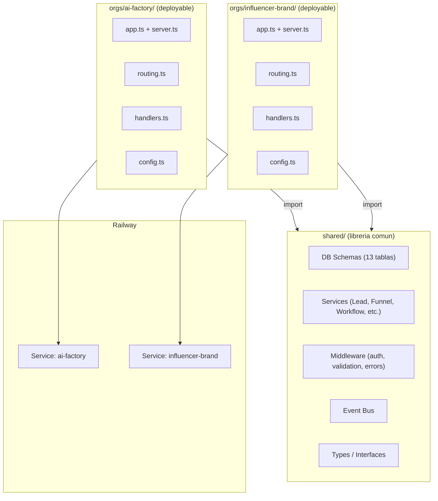
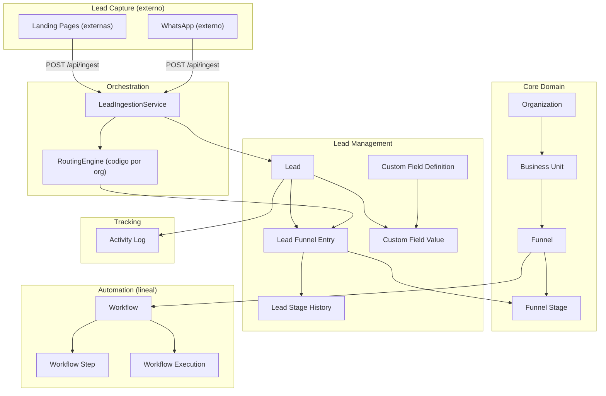
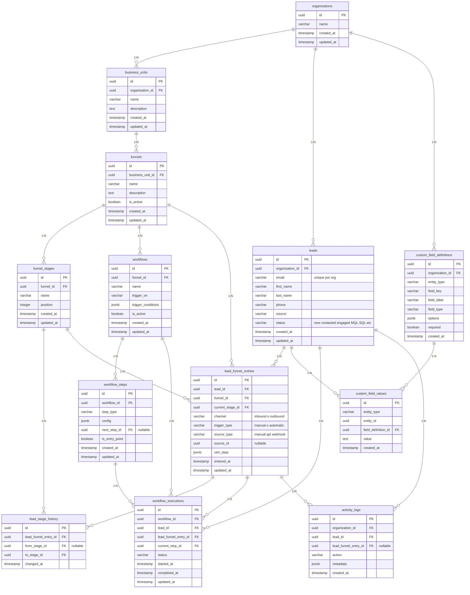
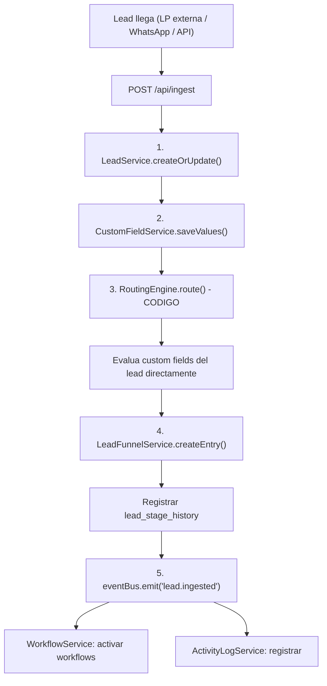
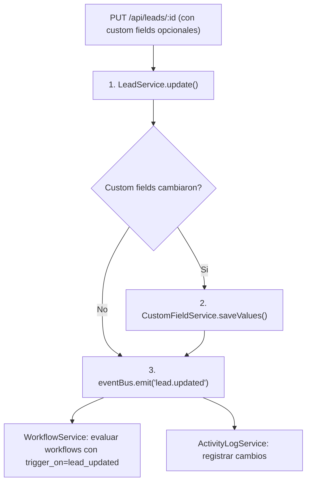
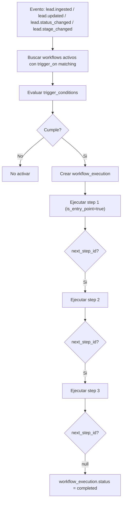
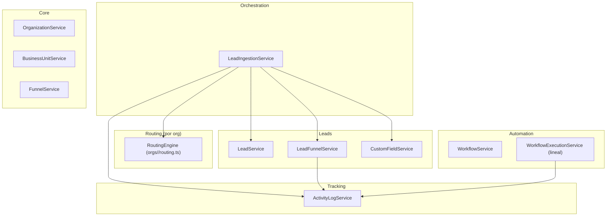

# MVP Marketing SaaS - Arquitectura Minima para Probar

> Referencia completa: [VISION-ARCHITECTURE.md](VISION-ARCHITECTURE.md) (scope maximo)

---

## 1. Que incluye el MVP vs que NO

| Feature | MVP | Vision | Notas |
|---|---|---|---|
| Lead ingestion (POST /api/ingest) | SI | SI | Igual |
| Lead storage + custom fields | SI | SI | Igual |
| Funnels + stages | SI | SI | Igual |
| Routing engine (codigo) | SI | SI | MVP: routing sobre data cruda del lead (custom fields). Sin ICP scores |
| Mover lead de stage | SI | SI | Igual |
| Lead stage history | SI | SI | Igual |
| Activity logs | SI | SI | Igual |
| UTM tracking | SI | SI | Igual |
| Workflows (lineales) | SI | SI (con branches) | MVP: step1 -> step2 -> step3. Sin bifurcaciones |
| Tests automatizados | SI | SI | Unit + Integration (Testcontainers) + E2E + CI |
| ICP scoring engine | NO | SI | Se agrega despues. Routing funciona sin scores |
| ICP tables (icps, criteria, scores) | NO | SI | Se agrega despues |
| Landing pages en DB | NO | SI | Las landing pages son externas. POSTean a /api/ingest |
| Channels en DB (WhatsApp) | NO | SI | Se agrega despues. Webhooks se configuran directamente |
| Workflow branches | NO | SI | Se agrega despues |
| funnel_icp_assignments | NO | SI | Reporting, no operacional |
| Swagger | NO | SI | Se agrega despues |
| Email integration | NO | SI | Fase 3 |
| ElevenLabs AI calls | NO | SI | Fase 3 |
| WhatsApp outbound | NO | SI | Fase 3 |
| Admin UI | NO | SI | Fase 3 |

---

## 2. Decisiones de Diseno MVP

| Decision | Valor |
|---|---|
| **Tech stack** | Express (TypeScript) + PostgreSQL + Drizzle ORM + drizzle-zod |
| **Validacion** | Zod (via drizzle-zod). Sin DTOs, sin decoradores |
| **Multi-tenancy** | No activo, `organization_id` en todas las tablas |
| **Funnel** | Entidad independiente, pertenece a una BU |
| **Lead** | Solo identidad (email, nombre, telefono). Todo lo demas en custom fields |
| **Email requerido** | Si, unique por org. Identificador para deduplicacion |
| **Routing** | Codigo puro en `orgs/<org>/routing.ts`. Evalua custom fields del lead directamente (sin ICP scores) |
| **Landing pages** | Externas (Webflow, HTML, etc). POSTean a /api/ingest. Sin tablas en DB |
| **Channels (WhatsApp)** | Sin tabla en DB. Si se necesita webhook, se configura directo en codigo contra /api/ingest |
| **ICP scoring** | No existe en MVP. Se agrega despues. Routing decide con data cruda |
| **Lead status** | Campo `status` en leads (ej: new, contacted, engaged, MQL, SQL). Valores libres (varchar), no enum. Se definen por configuracion despues |
| **Arquitectura repo** | Monorepo: `shared/` (schemas, services, middleware) + `orgs/<nombre>/` (app deployable por org). Cada org importa de shared y define su routing, handlers y config. Deploy independiente en Railway |
| **Testing** | Vitest + Supertest + Testcontainers (PostgreSQL efimero). Unit, Integration, E2E. CI con GitHub Actions |
| **Workflows MVP** | Lineales (next_step_id). Sin branches |

---

## 3. Diagrama de Bloques MVP

### Arquitectura Monorepo



### Diagrama de Dominio



---

## 4. Base de Datos MVP (13 tablas)

Tablas eliminadas vs Vision (8 tablas menos):
- ~~icps~~ (ICP scoring no existe en MVP)
- ~~icp_criteria~~ (idem)
- ~~lead_icp_scores~~ (idem)
- ~~landing_pages~~ (landing pages son externas)
- ~~landing_page_fields~~ (idem)
- ~~channels~~ (webhooks se configuran directo en codigo)
- ~~funnel_icp_assignments~~ (solo reporting)
- ~~workflow_step_branches~~ (sin bifurcaciones)



---

## 5. Flujo Principal MVP: Ingestion End-to-End



Sin ICP scoring: el routing engine (definido en `orgs/<org>/routing.ts`) evalua los custom fields directamente. Ver ejemplo en seccion 9.

### Flujo de Lead Update



El `PUT /api/leads/:id` acepta tanto campos core (first_name, last_name, phone) como custom fields. Si los custom fields cambian, se actualizan y el evento `lead.updated` permite que workflows reaccionen (ej: si el lead ahora cumple criterios de un funnel distinto, un workflow puede re-routearlo).

### Flujo de Workflow Lineal MVP



---

## 6. Services MVP (10 servicios + 1 orquestador)

Eliminados vs Vision:
- ~~ICPService~~ (no hay tablas ICP)
- ~~ICPScoringService~~ (no hay scoring)
- ~~LandingPageService~~ (no hay tablas de LP)
- ~~ChannelService~~ (no hay tabla channels)



| Servicio | Tablas | Que hace en MVP |
|---|---|---|
| **LeadIngestionService** | - | Orquesta: crear lead, custom fields, routing, entry, eventos |
| **OrganizationService** | organizations | CRUD orgs |
| **BusinessUnitService** | business_units | CRUD BUs |
| **FunnelService** | funnels, funnel_stages | CRUD funnels + stages |
| **LeadService** | leads | CRUD leads, deduplicacion por email |
| **LeadFunnelService** | lead_funnel_entries, lead_stage_history | Crear entries, mover stage, historial |
| **CustomFieldService** | custom_field_definitions, custom_field_values | Definir y guardar campos |
| **RoutingEngine** | - | Codigo por org (`orgs/<org>/routing.ts`): evalua custom fields, decide funnel |
| **WorkflowService** | workflows, workflow_steps | CRUD workflows + steps lineales |
| **WorkflowExecutionService** | workflow_executions | Ejecutar workflows lineales |
| **ActivityLogService** | activity_logs | Registrar acciones |

---

## 7. API Endpoints MVP

### Setup (configurar el sistema)

```
POST   /api/organizations                      Crear org
GET    /api/organizations/:id                   Obtener org

POST   /api/business-units                      Crear BU
GET    /api/business-units                      Listar BUs
GET    /api/business-units/:id                  Obtener BU
PUT    /api/business-units/:id                  Actualizar BU
DELETE /api/business-units/:id                  Eliminar BU

POST   /api/funnels                             Crear funnel
GET    /api/funnels                             Listar funnels
GET    /api/funnels/:id                         Obtener funnel con stages
PUT    /api/funnels/:id                         Actualizar funnel
DELETE /api/funnels/:id                         Eliminar funnel
POST   /api/funnels/:id/stages                  Agregar stage
PUT    /api/funnels/:id/stages/:sid             Actualizar stage
DELETE /api/funnels/:id/stages/:sid             Eliminar stage

POST   /api/custom-fields                       Crear definicion de campo
GET    /api/custom-fields                       Listar definiciones
PUT    /api/custom-fields/:id                   Actualizar definicion
DELETE /api/custom-fields/:id                   Eliminar definicion
```

### Operacion (uso diario)

```
POST   /api/ingest                              Entrada principal de leads

POST   /api/leads                               Crear lead manual
GET    /api/leads                               Listar leads (paginado, filtros)
GET    /api/leads/:id                           Detalle lead completo
PUT    /api/leads/:id                           Actualizar lead (core + custom fields)
DELETE /api/leads/:id                           Eliminar lead
GET    /api/leads/:id/funnels                   En que funnels esta
POST   /api/leads/:id/funnels                   Asignar a funnel manual
PUT    /api/leads/:id/funnels/:eid              Mover de stage
DELETE /api/leads/:id/funnels/:eid              Sacar de funnel
GET    /api/leads/:id/activity                  Actividad del lead
```

### Automation

```
POST   /api/workflows                           Crear workflow
GET    /api/workflows                           Listar workflows
GET    /api/workflows/:id                       Obtener con steps
PUT    /api/workflows/:id                       Actualizar workflow
DELETE /api/workflows/:id                       Eliminar workflow
POST   /api/workflows/:id/steps                 Agregar step
PUT    /api/workflows/:id/steps/:sid            Actualizar step
DELETE /api/workflows/:id/steps/:sid            Eliminar step
GET    /api/workflow-executions                  Listar ejecuciones
GET    /api/workflow-executions/:id              Estado de ejecucion
```

### Tracking e Infra

```
GET    /api/activity                            Listar actividad
GET    /api/health                              Health check
```

---

## 8. Event System MVP

| Evento | Emitido por | Consumido por |
|---|---|---|
| `lead.ingested` | LeadIngestionService | WorkflowService, ActivityLogService |
| `lead.updated` | LeadService | WorkflowService, ActivityLogService |
| `lead.status_changed` | LeadService | WorkflowService, ActivityLogService |
| `lead.stage_changed` | LeadFunnelService | WorkflowService, ActivityLogService |
| `workflow.step_completed` | WorkflowExecutionService | ActivityLogService |
| `workflow.completed` | WorkflowExecutionService | ActivityLogService |

Implementacion: EventEmitter de Node.js tipado en `src/events/event-bus.ts`.

---

## 9. Estructura del Proyecto MVP (Monorepo)

```
marketing-funnel/
├── package.json                             Monorepo root (workspaces)
├── tsconfig.base.json                       Config TS compartida
├── docker-compose.yml                       PostgreSQL
│
├── shared/                                  LIBRERIA COMUN (importada por cada org)
│   ├── package.json
│   ├── tsconfig.json
│   ├── drizzle.config.ts
│   │
│   ├── db/
│   │   ├── schema/                          SOURCE OF TRUTH (13 tablas)
│   │   │   ├── core.schema.ts               organizations, BUs, funnels, stages
│   │   │   ├── leads.schema.ts              leads, entries, stage_history, custom fields
│   │   │   ├── automation.schema.ts         workflows, steps, executions
│   │   │   ├── tracking.schema.ts           activity logs
│   │   │   └── index.ts
│   │   └── client.ts                        Conexion PostgreSQL + Drizzle
│   │
│   ├── services/
│   │   ├── core/
│   │   │   ├── organization.service.ts
│   │   │   ├── business-unit.service.ts
│   │   │   └── funnel.service.ts
│   │   ├── leads/
│   │   │   ├── lead.service.ts
│   │   │   ├── lead-funnel.service.ts
│   │   │   └── custom-field.service.ts
│   │   ├── automation/
│   │   │   ├── workflow.service.ts
│   │   │   └── workflow-execution.service.ts
│   │   ├── tracking/
│   │   │   └── activity-log.service.ts
│   │   └── ingestion/
│   │       └── lead-ingestion.service.ts
│   │
│   ├── routes/
│   │   ├── core.routes.ts                   orgs, BUs, funnels
│   │   ├── leads.routes.ts                  leads, entries, custom fields
│   │   ├── automation.routes.ts             workflows, steps, executions
│   │   ├── tracking.routes.ts               activity logs
│   │   ├── ingestion.routes.ts              POST /api/ingest
│   │   └── index.ts
│   │
│   ├── middleware/
│   │   ├── error-handler.ts
│   │   ├── auth.ts
│   │   ├── validate.ts
│   │   └── pagination.ts
│   │
│   ├── events/
│   │   ├── event-bus.ts
│   │   └── listeners.ts
│   │
│   ├── types/
│   │   ├── routing.types.ts                 RoutingDecision, SourceInfo, etc.
│   │   ├── handlers.types.ts                WorkflowStepHandler interface
│   │   └── config.types.ts                  OrgConfig interface
│   │
│   └── index.ts                             Re-export todo
│
├── orgs/                                    UNA CARPETA POR ORGANIZACION
│   ├── ai-factory/                          Deploy independiente en Railway
│   │   ├── package.json                     Depende de "shared"
│   │   ├── tsconfig.json
│   │   ├── .env                             DB_URL, API_KEY, PORT
│   │   ├── Dockerfile
│   │   └── src/
│   │       ├── app.ts                       Express app (importa routes de shared)
│   │       ├── server.ts                    Entry point
│   │       ├── routing.ts                   Reglas de routing de AI Factory
│   │       ├── handlers.ts                  Handlers de workflow steps
│   │       └── config.ts                    Statuses, defaults, settings
│   │
│   └── influencer-brand/                    Otro deploy independiente
│       ├── package.json
│       ├── tsconfig.json
│       ├── .env
│       ├── Dockerfile
│       └── src/
│           ├── app.ts
│           ├── server.ts
│           ├── routing.ts                   Logica distinta (por seguidores, etc.)
│           ├── handlers.ts
│           └── config.ts
│
└── drizzle/
    └── migrations/
```

### Que va en cada org (3 archivos clave + wiring)

**`routing.ts`** - Reglas de routing de la org:
```typescript
import { RoutingEngine } from '@shared/types/routing.types';

export const routingEngine: RoutingEngine = (lead, customFields, source) => {
  const role = customFields['role'];
  const companySize = parseInt(customFields['company_size'] || '0');

  if (['CTO', 'VP Eng'].includes(role) && companySize >= 50) {
    return [{ funnelId: 'enterprise-b2b-id', initialStageId: 'qualify-id', channel: 'inbound' }];
  }
  return [];
};
```

**`handlers.ts`** - Que hace cada tipo de workflow step:
```typescript
import { StepHandlerMap } from '@shared/types/handlers.types';

export const stepHandlers: StepHandlerMap = {
  email: async (step, lead) => { /* enviar email */ },
  wait: async (step, lead) => { /* programar delay */ },
  task: async (step, lead) => { /* crear tarea manual */ },
};
```

**`config.ts`** - Settings de la org:
```typescript
import { OrgConfig } from '@shared/types/config.types';

export const config: OrgConfig = {
  defaultLeadStatus: 'new',
  validStatuses: ['new', 'contacted', 'engaged', 'MQL', 'SQL'],
  timezone: 'America/Lima',
};
```

**`app.ts`** - Wiring (importa shared + inyecta lo custom):
```typescript
import { createApp } from '@shared';
import { routingEngine } from './routing';
import { stepHandlers } from './handlers';
import { config } from './config';

const app = createApp({ routingEngine, stepHandlers, config });
export default app;
```

---

## 10. Fases de Ejecucion MVP

### Fase 1 - Fundacion
1. Monorepo root (workspaces, tsconfig base, docker-compose)
2. Drizzle schemas (13 tablas, source of truth)
3. DB client + migraciones
4. Middleware comun (auth, validation, errors, pagination)

### Fase 2 - Services + Routes
1. Services core (Org, BU, Funnel)
2. Services leads (Lead, LeadFunnel, CustomField)
3. Services automation (Workflow, WorkflowExecution lineal)
4. Service tracking (ActivityLog)
5. Service ingestion (orquestador)
6. Event system (EventEmitter tipado + listeners)
7. Routes (core, leads, automation, tracking, ingestion)

### Fase 3 - Types + createApp + Primera Org
1. Types/interfaces (RoutingEngine, StepHandlerMap, OrgConfig)
2. createApp() factory que wirea todo
3. orgs/ai-factory/ (routing, handlers, config, app, server)
4. Validar que deploya en Railway

### Fase 4 - Testing
1. Vitest setup (config global, Testcontainers)
2. Tests unitarios de services
3. Tests de integracion (flujos con DB real)
4. Tests E2E por org
5. GitHub Actions CI pipeline

---

## 11. Que falta para llegar a la Vision

Despues de validar el MVP, agregar iterativamente:

1. **Channels en DB**: Agregar tabla `channels` + ChannelService para gestionar webhooks de WhatsApp y otros canales
2. **ICP scoring**: Agregar tablas `icps`, `icp_criteria`, `lead_icp_scores` + ICPService + ICPScoringService. El routing engine pasa a usar scores ademas de data cruda
3. **Landing pages en DB**: Agregar tablas `landing_pages`, `landing_page_fields` + LandingPageService + builder/render
4. **Workflow branches**: Agregar tabla `workflow_step_branches` + logica de bifurcacion
5. **funnel_icp_assignments**: Tabla para reporting
6. **Swagger**: swagger-jsdoc + swagger-ui-express
7. **Job Queue**: BullMQ + Redis para workflows async con delays
8. **Email integration**: Provider de email
9. **WhatsApp outbound**: Enviar mensajes via WhatsApp Business API
10. **ElevenLabs**: AI calls como workflow step
11. **Admin UI**: Frontend

---

## 11. Testing Automatizado

### Herramientas

| Herramienta | Para que |
|---|---|
| **Vitest** | Test runner (rapido, TS nativo, compatible Jest API) |
| **Supertest** | HTTP assertions contra Express app sin levantar server |
| **Testcontainers** | PostgreSQL efimero para integration/E2E (sin instalar nada local) |
| **@faker-js/faker** | Generar data de prueba |
| **GitHub Actions** | CI: lint + typecheck + tests en cada push/PR |

### Estructura de tests

```
shared/
  __tests__/
    unit/                              Tests rapidos con mocks
      lead.service.test.ts
      funnel.service.test.ts
      custom-field.service.test.ts
      workflow.service.test.ts
      workflow-execution.service.test.ts
      lead-funnel.service.test.ts
      event-bus.test.ts
    integration/                       Tests con DB real (Testcontainers)
      ingestion-flow.test.ts
      lead-update-flow.test.ts
      stage-change-flow.test.ts
      workflow-execution.test.ts
      crud-endpoints.test.ts
      error-handling.test.ts
    helpers/
      setup.ts                         Testcontainers PostgreSQL + migraciones
      factories.ts                     Factories para crear data de prueba

orgs/ai-factory/
  __tests__/
    e2e/
      full-lifecycle.test.ts           Setup -> ingest -> route -> workflow -> verify
```

### Unit Tests (shared/__tests__/unit/)

Tests rapidos con mocks de DB. Verifican logica de negocio aislada:

| Test | Que verifica |
|---|---|
| LeadService | Crear lead, dedup por email, update campos, cambio de status emite `lead.status_changed` |
| FunnelService | Crear funnel, agregar stages, validar posiciones unicas |
| CustomFieldService | Crear definitions, guardar values, validar field_type |
| WorkflowService | Crear workflow, agregar steps lineales, validar entry point unico |
| WorkflowExecutionService | Ejecutar step, avanzar next_step_id, completar cuando null |
| LeadFunnelService | Crear entry con stage history, mover stage, registrar history |
| Event bus | Emitir evento, listener recibe payload correcto, tipos compilados |

### Integration Tests (shared/__tests__/integration/)

Tests con DB real (PostgreSQL via Testcontainers). Verifican flujos completos a traves de la API:

| Test | Que verifica |
|---|---|
| **Ingestion flow** | `POST /api/ingest` -> lead creado -> custom fields guardados -> routing -> funnel entry creada -> stage history -> eventos emitidos |
| **Lead update flow** | `PUT /api/leads/:id` -> campos actualizados -> `lead.updated` emitido -> workflow triggered |
| **Stage change flow** | `PUT /api/leads/:id/funnels/:eid` -> stage cambiado -> history registrada -> `lead.stage_changed` emitido |
| **Workflow execution** | Crear workflow 3 steps -> trigger -> step 1 -> step 2 -> step 3 -> status completed |
| **CRUD endpoints** | Cada endpoint crea, lee, actualiza, elimina, lista con paginacion |
| **Error handling** | Zod rechaza payloads invalidos, auth rechaza sin API key, 404 en recursos inexistentes |

### E2E Tests (orgs/ai-factory/__tests__/e2e/)

Tests que simulan uso real de la org completa:

| Test | Que verifica |
|---|---|
| **Setup completo** | Crear org -> BU -> funnel -> stages -> custom fields -> workflow |
| **Lead lifecycle** | Ingest lead -> routing correcto -> mover stages -> history completa |
| **Workflow trigger** | Lead ingested -> workflow se activa -> steps ejecutan en orden |
| **Lead update trigger** | Actualizar custom fields -> workflow con `trigger_on=lead_updated` se activa |
| **Status change** | Cambiar status -> `lead.status_changed` -> workflow reacciona |
| **Deduplicacion** | Ingest mismo email 2 veces -> 1 lead, datos actualizados |

### CI Pipeline (GitHub Actions)

```yaml
# .github/workflows/ci.yml
on: [push, pull_request]
jobs:
  test:
    runs-on: ubuntu-latest
    steps:
      - checkout
      - setup node 20
      - install dependencies
      - run: npm run lint
      - run: npm run typecheck
      - run: npm run test:unit
      - run: npm run test:integration    # Testcontainers levanta PostgreSQL
```

---

## 12. Ejemplo End-to-End MVP

```
0. DEPLOY:
   - Crear carpeta orgs/ai-factory/ con routing.ts, handlers.ts, config.ts
   - En routing.ts: si role=CTO y company_size>=50 -> Funnel Enterprise B2B
   - Deploy a Railway como servicio "ai-factory"

1. SETUP (via API):
   POST /api/organizations          -> Crear "AI Factory"
   POST /api/business-units         -> Crear "SaaS Product"
   POST /api/custom-fields          -> Definir campos: company, role, company_size, industry
   POST /api/funnels                -> Crear "Enterprise B2B"
   POST /api/funnels/:id/stages     -> Qualify (pos 1), Demo (pos 2), Proposal (pos 3), Close (pos 4)
   POST /api/workflows              -> Crear workflow trigger_on=lead_created
   POST /api/workflows/:id/steps    -> Step 1: email bienvenida (is_entry_point=true)
   POST /api/workflows/:id/steps    -> Step 2: wait 3 dias
   POST /api/workflows/:id/steps    -> Step 3: email follow-up

2. LEAD LLEGA:
   Landing page EXTERNA envia:
   POST /api/ingest {
     email: "juan@techcorp.com",
     firstName: "Juan",
     source: "api",
     channel: "inbound",
     utmData: { utm_campaign: "black_friday" },
     customFields: { company: "TechCorp", role: "CTO", company_size: "150" }
   }

3. SISTEMA PROCESA:
   LeadIngestionService:
   -> Crea lead "Juan" (dedup por email)
   -> Guarda custom fields (company=TechCorp, role=CTO, company_size=150)
   -> RoutingEngine: role=CTO + company_size=150 -> Funnel "Enterprise B2B", stage "Qualify"
   -> Crea lead_funnel_entry + lead_stage_history (null -> Qualify)
   -> eventBus.emit('lead.ingested')
   -> WorkflowService detecta workflow, crea execution, ejecuta step 1
   -> ActivityLogService registra todo

4. VERIFICAR:
   GET /api/leads/:id          -> Juan con funnels y custom fields
   GET /api/leads/:id/activity -> toda la traza
   GET /api/workflow-executions -> workflow en ejecucion

5. OPERAR:
   PUT /api/leads/:id/funnels/:eid { stageId: "demo-id" }
   -> Mueve Juan de Qualify a Demo
   -> lead_stage_history registra (Qualify -> Demo)
   -> eventBus.emit('lead.stage_changed')
```
