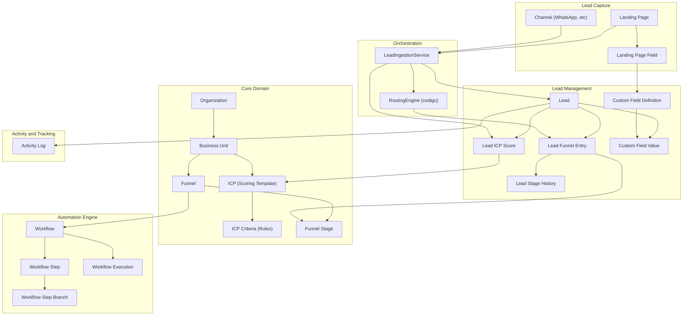
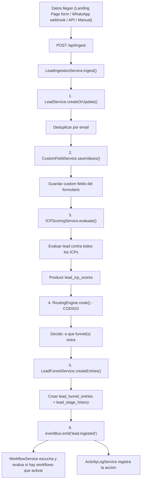
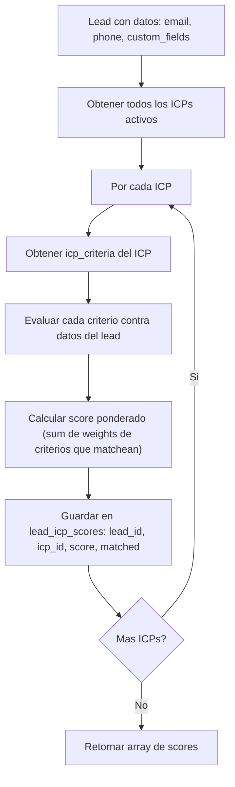
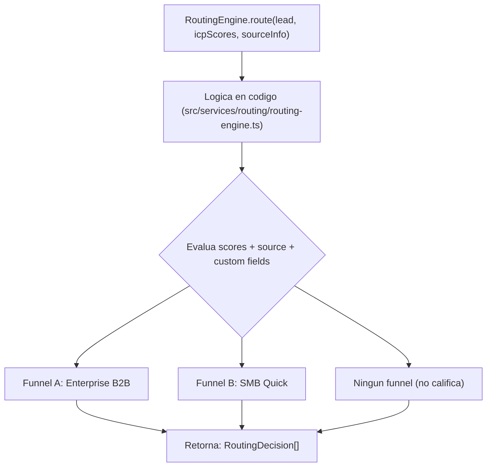
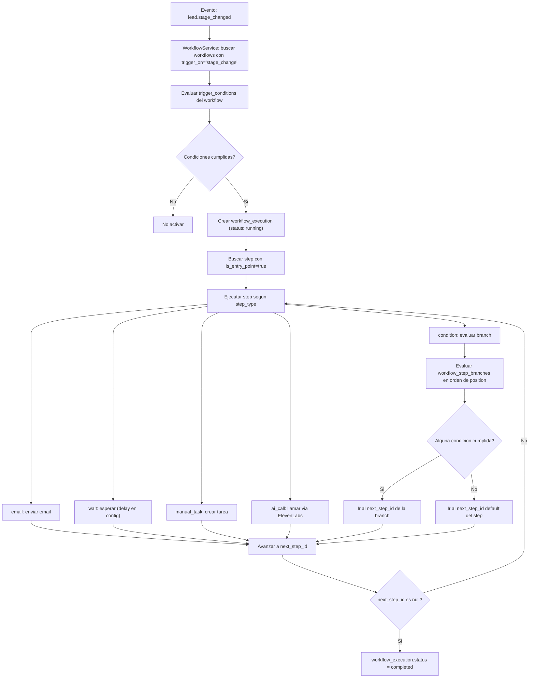
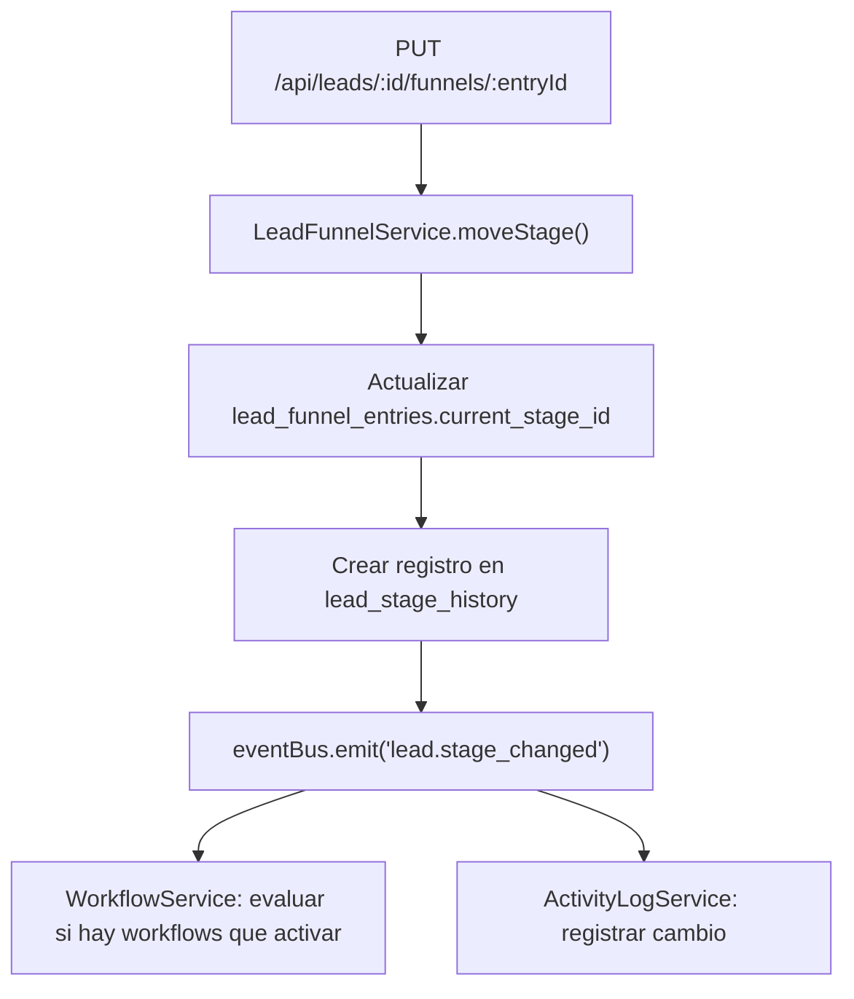
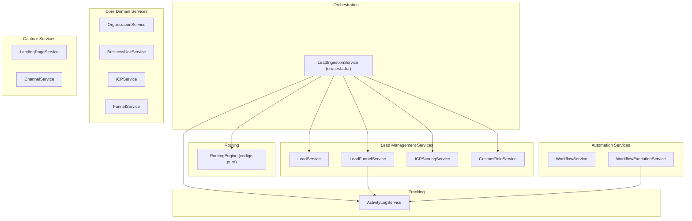

# Vision Marketing SaaS - Arquitectura Completa (Scope Maximo)

## 1. Decisiones de Diseno

| Decisión | Valor | Razón |
|---|---|---|
| **Tech stack** | Express (TypeScript) + PostgreSQL + Drizzle ORM + drizzle-zod | Express como servidor HTTP ligero. Drizzle como source of truth de DB. drizzle-zod genera Zod schemas + TS types automáticamente |
| **Validación** | Zod (via drizzle-zod) | Un schema sirve para validar y tipar. Sin DTOs, sin decoradores. Middleware de validación con Zod |
| **Multi-tenancy** | No activo, `organization_id` en todas las tablas | Preparado para activar después sin reestructurar la DB |
| **Funnel** | Entidad independiente, pertenece a una BU | No está anidado en ICP ni atado jerárquicamente. Máxima flexibilidad |
| **ICP** | Scoring template con criterios de calificación | No es un folder estático. Define reglas (field_key, operator, value, weight) que evalúan leads automáticamente |
| **Lead** | Solo campos de identidad + custom fields | email, nombre, teléfono en la tabla. Todo lo demás (company, role, instagram, age) en custom_field_values. Soporta B2B y B2C |
| **Lead en múltiples funnels** | Sí | Un lead puede estar en N funnels simultáneamente via lead_funnel_entries |
| **Landing pages y Channels** | Solo capturan data, NO deciden el funnel | El ICP scoring + routing engine (código) deciden a qué funnel va el lead |
| **Routing rules** | Código en src/services/routing/, NO en la DB | Máxima flexibilidad para iterar campañas y cambiar lógica sin migraciones |
| **Workflow engine** | Modelo de grafo (next_step_id) con branches | Funciona como lista lineal para cadencias simples, escala a branches sin migración |
| **Triggers** | No existen como tabla separada | Eliminados por redundancia. Ingestion lo maneja el IngestionService. Eventos de funnel los manejan los workflows con trigger_on + trigger_conditions |
| **Source of truth** | Drizzle table schemas | Generan migraciones, Zod schemas y TypeScript types. No se mantienen tipos ni migraciones manuales |
| **Custom fields polimórficos** | entity_type + entity_id en custom_field_values | Sin FK real sobre entity_id (puede apuntar a leads, funnel_entries, etc.). Trade-off aceptado por flexibilidad |
| **Email requerido** | Email obligatorio y unique por org | Identificador principal para deduplicación de leads |

---

## 2. Arquitectura de Bloques



---

## 3. Diagrama ER - Base de Datos (21 tablas)

```mermaid
erDiagram
    organizations ||--o{ business_units : "1 org tiene N BUs"
    business_units ||--o{ icps : "1 BU tiene N ICPs"
    business_units ||--o{ funnels : "1 BU tiene N funnels"
    icps ||--o{ icp_criteria : "1 ICP tiene N criterios"
    funnels ||--o{ funnel_stages : "1 funnel tiene N stages"
    funnels ||--o{ workflows : "1 funnel tiene N workflows"
    funnels ||--o{ funnel_icp_assignments : "N funnels a N ICPs"
    icps ||--o{ funnel_icp_assignments : "N ICPs a N funnels"
    organizations ||--o{ leads : "1 org tiene N leads"
    leads ||--o{ lead_funnel_entries : "1 lead en N funnels"
    lead_funnel_entries ||--o{ lead_stage_history : "1 entry tiene N cambios de stage"
    funnel_stages ||--o{ lead_stage_history : "stage origen o destino"
    funnels ||--o{ lead_funnel_entries : "1 funnel tiene N entries"
    funnel_stages ||--o{ lead_funnel_entries : "1 stage tiene N leads"
    leads ||--o{ lead_icp_scores : "1 lead scored en N ICPs"
    icps ||--o{ lead_icp_scores : "1 ICP evalua N leads"
    organizations ||--o{ custom_field_definitions : "1 org define N campos"
    custom_field_definitions ||--o{ custom_field_values : "1 def tiene N valores"
    leads ||--o{ custom_field_values : "1 lead tiene N valores"
    workflows ||--o{ workflow_steps : "1 workflow tiene N steps"
    workflow_steps ||--o{ workflow_step_branches : "1 step tiene N branches"
    workflows ||--o{ workflow_executions : "1 workflow tiene N ejecuciones"
    leads ||--o{ workflow_executions : "1 lead tiene N ejecuciones"
    lead_funnel_entries ||--o{ workflow_executions : "1 entry tiene N ejecuciones"
    workflow_steps ||--o{ workflow_executions : "step actual en ejecucion"
    leads ||--o{ activity_logs : "1 lead tiene N logs"
    lead_funnel_entries ||--o{ activity_logs : "1 entry tiene N logs"
    organizations ||--o{ landing_pages : "1 org tiene N landing pages"
    landing_pages ||--o{ landing_page_fields : "1 page tiene N fields"
    custom_field_definitions ||--o{ landing_page_fields : "1 field def mapeada en N pages"
    organizations ||--o{ channels : "1 org tiene N channels"

    organizations {
        uuid id PK
        varchar name
        timestamp created_at
        timestamp updated_at
    }

    business_units {
        uuid id PK
        uuid organization_id FK
        varchar name
        text description
        timestamp created_at
        timestamp updated_at
    }

    icps {
        uuid id PK
        uuid business_unit_id FK
        varchar name
        text description
        timestamp created_at
        timestamp updated_at
    }

    icp_criteria {
        uuid id PK
        uuid icp_id FK
        varchar field_key
        varchar operator
        varchar value
        integer weight
        timestamp created_at
        timestamp updated_at
    }

    funnels {
        uuid id PK
        uuid business_unit_id FK
        varchar name
        text description
        boolean is_active
        timestamp created_at
        timestamp updated_at
    }

    funnel_stages {
        uuid id PK
        uuid funnel_id FK
        varchar name
        integer position
        timestamp created_at
        timestamp updated_at
    }

    funnel_icp_assignments {
        uuid funnel_id PK "composite PK"
        uuid icp_id PK "composite PK"
        timestamp created_at
    }

    leads {
        uuid id PK
        uuid organization_id FK
        varchar email "unique por org"
        varchar first_name
        varchar last_name
        varchar phone
        varchar source
        timestamp created_at
        timestamp updated_at
    }

    lead_funnel_entries {
        uuid id PK
        uuid lead_id FK
        uuid funnel_id FK
        uuid current_stage_id FK
        varchar channel "inbound o outbound"
        varchar trigger_type "manual o automatic"
        varchar source_type "landing_page channel manual api"
        uuid source_id "nullable - id del origen"
        jsonb utm_data "utm_source utm_medium utm_campaign etc"
        timestamp entered_at
        timestamp updated_at
    }

    lead_stage_history {
        uuid id PK
        uuid lead_funnel_entry_id FK
        uuid from_stage_id FK "nullable en primera entrada"
        uuid to_stage_id FK
        timestamp changed_at
    }

    lead_icp_scores {
        uuid id PK
        uuid lead_id FK
        uuid icp_id FK
        integer score
        boolean matched
        timestamp evaluated_at
    }

    custom_field_definitions {
        uuid id PK
        uuid organization_id FK
        varchar entity_type "lead funnel_entry etc"
        varchar field_key
        varchar field_label
        varchar field_type "text number date select boolean"
        jsonb options "opciones para tipo select"
        boolean required
        timestamp created_at
    }

    custom_field_values {
        uuid id PK
        varchar entity_type "polimorfismo - sin FK real"
        uuid entity_id "id de la entidad relacionada"
        uuid field_definition_id FK
        text value
        timestamp created_at
    }

    workflows {
        uuid id PK
        uuid funnel_id FK
        varchar name
        varchar trigger_on "stage_change lead_created score_threshold manual"
        jsonb trigger_conditions "condiciones para activar"
        boolean is_active
        timestamp created_at
        timestamp updated_at
    }

    workflow_steps {
        uuid id PK
        uuid workflow_id FK
        varchar step_type "email ai_call manual_task wait condition"
        jsonb config "template delay params etc"
        uuid next_step_id FK "nullable - default next"
        boolean is_entry_point
        timestamp created_at
        timestamp updated_at
    }

    workflow_step_branches {
        uuid id PK
        uuid step_id FK "step tipo condition"
        varchar condition_logic
        jsonb condition_config
        uuid next_step_id FK "destino si cumple condicion"
        integer position "orden de evaluacion"
        timestamp created_at
    }

    workflow_executions {
        uuid id PK
        uuid workflow_id FK
        uuid lead_id FK
        uuid lead_funnel_entry_id FK
        uuid current_step_id FK
        varchar status "pending running paused completed failed"
        timestamp started_at
        timestamp completed_at
        timestamp updated_at
    }

    activity_logs {
        uuid id PK
        uuid organization_id FK
        uuid lead_id FK
        uuid lead_funnel_entry_id FK "nullable"
        varchar action "stage_changed email_sent call_made etc"
        jsonb metadata
        timestamp created_at
    }

    landing_pages {
        uuid id PK
        uuid organization_id FK
        varchar name
        varchar slug
        varchar status "draft o published"
        jsonb template_config
        timestamp created_at
        timestamp updated_at
    }

    landing_page_fields {
        uuid id PK
        uuid landing_page_id FK
        uuid custom_field_definition_id FK
        varchar label
        integer position
        boolean required
        timestamp created_at
    }

    channels {
        uuid id PK
        uuid organization_id FK
        varchar channel_type "whatsapp sms telegram etc"
        varchar name
        jsonb config "api_key phone webhook_url etc"
        boolean is_active
        timestamp created_at
        timestamp updated_at
    }
```



---

## 4. Detalle de Tablas por Bloque

### Bloque 1 - Core Domain (7 tablas)

| Tabla | Descripción | Campos clave |
|---|---|---|
| **organizations** | Entidad raíz. Preparada para multi-tenancy | id, name |
| **business_units** | División de negocio dentro de una org | organization_id FK, name, description |
| **icps** | Scoring template. Define perfil de cliente ideal como reglas evaluables | business_unit_id FK, name, description |
| **icp_criteria** | Reglas de un ICP. Cada regla tiene campo, operador, valor y peso | icp_id FK, field_key, operator (eq/neq/gt/lt/in/contains), value, weight |
| **funnels** | Journey independiente. Pertenece a una BU pero no atado a un ICP | business_unit_id FK, name, is_active |
| **funnel_stages** | Etapas ordenadas dentro de un funnel | funnel_id FK, name, position |
| **funnel_icp_assignments** | Many-to-many entre funnels e ICPs. Para reporting y referencia | PK compuesto (funnel_id, icp_id) |

### Bloque 2 - Lead Management (6 tablas)

| Tabla | Descripción | Campos clave |
|---|---|---|
| **leads** | Persona. Solo identidad. Todo dato adicional va en custom fields | organization_id FK, email (unique por org), first_name, last_name, phone, source |
| **lead_funnel_entries** | Un lead en un funnel. Guarda stage actual, canal, origen, UTMs | lead_id FK, funnel_id FK, current_stage_id FK, channel, source_type, source_id, utm_data (jsonb) |
| **lead_stage_history** | Historial de movimientos de stage. Para medir conversión y tiempo por stage | lead_funnel_entry_id FK, from_stage_id (nullable), to_stage_id, changed_at |
| **lead_icp_scores** | Resultado de evaluar un lead contra un ICP | lead_id FK, icp_id FK, score, matched (boolean), evaluated_at |
| **custom_field_definitions** | Definición de campos personalizados por org y entity_type | organization_id FK, entity_type, field_key, field_label, field_type, options (jsonb), required |
| **custom_field_values** | Valores de campos personalizados. Asociación polimórfica (sin FK real en entity_id) | entity_type, entity_id, field_definition_id FK, value |

### Bloque 3 - Automation Engine (4 tablas)

| Tabla | Descripción | Campos clave |
|---|---|---|
| **workflows** | Automatización. Se activa por eventos (stage_change, lead_created, etc.) con condiciones | funnel_id FK, name, trigger_on, trigger_conditions (jsonb), is_active |
| **workflow_steps** | Nodo del grafo. Puede ser email, AI call, tarea manual, wait, o condition | workflow_id FK, step_type, config (jsonb), next_step_id FK (self-ref, nullable), is_entry_point |
| **workflow_step_branches** | Salidas condicionales de un step tipo "condition". Permite bifurcaciones | step_id FK, condition_logic, condition_config (jsonb), next_step_id FK, position |
| **workflow_executions** | Instancia de un workflow corriendo para un lead específico | workflow_id FK, lead_id FK, lead_funnel_entry_id FK, current_step_id FK, status |

### Bloque 4 - Lead Capture (3 tablas)

| Tabla | Descripción | Campos clave |
|---|---|---|
| **landing_pages** | Página de captura. SIN funnel_id: solo captura data | organization_id FK, name, slug, status, template_config (jsonb) |
| **landing_page_fields** | Campos del formulario. Mapean a custom_field_definitions existentes | landing_page_id FK, custom_field_definition_id FK, label, position, required |
| **channels** | Canal de comunicación (WhatsApp, SMS, etc.). SIN funnel_id | organization_id FK, channel_type, name, config (jsonb), is_active |

### Bloque 5 - Activity and Tracking (1 tabla)

| Tabla | Descripción | Campos clave |
|---|---|---|
| **activity_logs** | Registro de toda acción del sistema. lead_id siempre, lead_funnel_entry_id opcional | organization_id FK, lead_id FK, lead_funnel_entry_id FK (nullable), action, metadata (jsonb) |

---

## 5. Flujos Principales

### 5.1 Flujo de Ingestion (el mas importante)



### 5.2 Flujo de ICP Scoring



Ejemplo concreto:

```
ICP "Enterprise CTO":
  - field_key: "role", operator: "in", value: "CTO,VP Eng", weight: 40
  - field_key: "company_size", operator: "gte", value: "50", weight: 30
  - field_key: "industry", operator: "eq", value: "SaaS", weight: 30

Lead Juan:
  - role: "CTO" -> matchea criterio 1 -> +40
  - company_size: "120" -> matchea criterio 2 -> +30
  - industry: "Fintech" -> NO matchea criterio 3 -> +0

Score: 70/100, matched: true (configurable via threshold)
```

### 5.3 Flujo de Routing (codigo)



```typescript
interface RoutingDecision {
  funnelId: string;
  initialStageId: string;
  channel: 'inbound' | 'outbound';
}

interface RoutingEngine {
  route(
    lead: Lead,
    scores: LeadICPScore[],
    source: { type: string; id?: string; utmData?: Record<string, string> }
  ): RoutingDecision[];
}
```

La logica de routing es codigo puro. Se puede cambiar con un deploy sin tocar la DB. Ejemplos de logica que soporta:
- "Si ICP Enterprise score > 70, entra a Funnel Enterprise"
- "Si viene de Landing B y tiene phone, entra a Funnel WhatsApp"
- "Si UTM campaign = 'black_friday', entra a Funnel Promo"

### 5.4 Flujo de Workflow (grafo)



### 5.5 Flujo de Cambio de Stage



---

## 6. Service Layer (15 servicios + 1 orquestador)



### Detalle de cada servicio

| Servicio | Carpeta | Tablas | Responsabilidad |
|---|---|---|---|
| **LeadIngestionService** | services/ingestion/ | Ninguna propia | Orquesta: crear lead, custom fields, scoring, routing, entry, eventos |
| **OrganizationService** | services/core/ | organizations | CRUD organizations |
| **BusinessUnitService** | services/core/ | business_units | CRUD business units |
| **ICPService** | services/core/ | icps, icp_criteria | CRUD ICPs + gestionar criterios de scoring |
| **FunnelService** | services/core/ | funnels, funnel_stages, funnel_icp_assignments | CRUD funnels + stages + asignar ICPs |
| **LeadService** | services/leads/ | leads | CRUD leads, deduplicacion por email |
| **LeadFunnelService** | services/leads/ | lead_funnel_entries, lead_stage_history | CRUD entries, mover de stage, registrar historial |
| **ICPScoringService** | services/leads/ | lead_icp_scores, icp_criteria | Evaluar lead contra ICPs, producir scores |
| **CustomFieldService** | services/leads/ | custom_field_definitions, custom_field_values | Definir campos, guardar/leer valores |
| **RoutingEngine** | services/routing/ | Ninguna (codigo puro) | Recibe lead + scores + source, decide funnel(s) |
| **WorkflowService** | services/automation/ | workflows, workflow_steps, workflow_step_branches | CRUD workflows, steps, branches |
| **WorkflowExecutionService** | services/automation/ | workflow_executions | Ejecutar workflows, avanzar steps, evaluar branches |
| **LandingPageService** | services/capture/ | landing_pages, landing_page_fields | CRUD landing pages y campos de formulario |
| **ChannelService** | services/capture/ | channels | Configurar canales, procesar webhooks entrantes |
| **ActivityLogService** | services/tracking/ | activity_logs | Registrar y consultar toda accion del sistema |

---

## 7. API Endpoints

### Core Domain

```
POST   /api/organizations                      Crear organizacion
GET    /api/organizations/:id                   Obtener organizacion

POST   /api/business-units                      Crear BU
GET    /api/business-units                      Listar BUs (filtrar por org)
GET    /api/business-units/:id                  Obtener BU
PUT    /api/business-units/:id                  Actualizar BU
DELETE /api/business-units/:id                  Eliminar BU

POST   /api/icps                                Crear ICP (scoring template)
GET    /api/icps                                Listar ICPs (filtrar por BU)
GET    /api/icps/:id                            Obtener ICP con criteria
PUT    /api/icps/:id                            Actualizar ICP
DELETE /api/icps/:id                            Eliminar ICP
POST   /api/icps/:id/criteria                   Agregar criterio
PUT    /api/icps/:id/criteria/:cid              Actualizar criterio
DELETE /api/icps/:id/criteria/:cid              Eliminar criterio

POST   /api/funnels                             Crear funnel
GET    /api/funnels                             Listar funnels (filtrar por BU)
GET    /api/funnels/:id                         Obtener funnel con stages
PUT    /api/funnels/:id                         Actualizar funnel
DELETE /api/funnels/:id                         Eliminar funnel
POST   /api/funnels/:id/stages                  Agregar stage
PUT    /api/funnels/:id/stages/:sid             Actualizar stage
DELETE /api/funnels/:id/stages/:sid             Eliminar stage
POST   /api/funnels/:id/icps                    Asignar ICP a funnel
DELETE /api/funnels/:id/icps/:icpId             Desasignar ICP
```

### Lead Management

```
POST   /api/leads                               Crear lead manualmente
GET    /api/leads                               Listar leads (filtros, paginacion)
GET    /api/leads/:id                           Detalle lead (scores, funnels, custom fields)
PUT    /api/leads/:id                           Actualizar lead
DELETE /api/leads/:id                           Eliminar lead
GET    /api/leads/:id/funnels                   En que funnels esta el lead
POST   /api/leads/:id/funnels                   Asignar lead a funnel manualmente
PUT    /api/leads/:id/funnels/:eid              Mover de stage
DELETE /api/leads/:id/funnels/:eid              Sacar lead de funnel
POST   /api/leads/:id/score                     Ejecutar scoring
GET    /api/leads/:id/scores                    Ver scores en todos los ICPs
GET    /api/leads/:id/activity                  Actividad del lead
```

### Ingestion (punto de entrada principal)

```
POST   /api/ingest                              Crear lead + scoring + routing + entry
```

Payload de ejemplo:

```json
{
  "email": "juan@empresa.com",
  "firstName": "Juan",
  "lastName": "Perez",
  "phone": "+5491155554444",
  "source": "landing_page",
  "sourceId": "uuid-de-la-landing",
  "channel": "inbound",
  "utmData": {
    "utm_source": "google",
    "utm_medium": "cpc",
    "utm_campaign": "black_friday_2026"
  },
  "customFields": {
    "company": "TechCorp",
    "role": "CTO",
    "company_size": "150",
    "industry": "SaaS"
  }
}
```

### Automation

```
POST   /api/workflows                           Crear workflow
GET    /api/workflows                           Listar workflows (filtrar por funnel)
GET    /api/workflows/:id                       Obtener workflow con steps y branches
PUT    /api/workflows/:id                       Actualizar workflow
DELETE /api/workflows/:id                       Eliminar workflow
POST   /api/workflows/:id/steps                 Agregar step
PUT    /api/workflows/:id/steps/:sid            Actualizar step
DELETE /api/workflows/:id/steps/:sid            Eliminar step
POST   /api/workflows/:id/steps/:sid/branches   Agregar branch
PUT    /api/workflows/:id/steps/:sid/branches/:bid  Actualizar branch
DELETE /api/workflows/:id/steps/:sid/branches/:bid  Eliminar branch
GET    /api/workflow-executions                  Listar ejecuciones
GET    /api/workflow-executions/:id              Estado de ejecucion
```

### Capture

```
POST   /api/landing-pages                       Crear landing page
GET    /api/landing-pages                       Listar landing pages
GET    /api/landing-pages/:id                   Obtener landing page con fields
PUT    /api/landing-pages/:id                   Actualizar landing page
DELETE /api/landing-pages/:id                   Eliminar landing page
POST   /api/landing-pages/:id/fields            Agregar campo al form
PUT    /api/landing-pages/:id/fields/:fid       Actualizar campo
DELETE /api/landing-pages/:id/fields/:fid       Eliminar campo
POST   /api/channels                            Crear canal
GET    /api/channels                            Listar canales
PUT    /api/channels/:id                        Actualizar canal
DELETE /api/channels/:id                        Eliminar canal
POST   /api/webhooks/:channelId                 Recibir data de canal externo
```

### Custom Fields

```
POST   /api/custom-fields                       Crear definicion de campo
GET    /api/custom-fields                       Listar definiciones (filtrar por entity_type)
PUT    /api/custom-fields/:id                   Actualizar definicion
DELETE /api/custom-fields/:id                   Eliminar definicion
```

### Tracking

```
GET    /api/activity                            Listar actividad (filtros: lead, funnel, action, fecha)
```

### Infra

```
GET    /api/health                              Health check
```

---

## 8. Event System

Comunicacion entre servicios via EventEmitter de Node.js (o eventemitter3 para tipado):

| Evento | Emitido por | Consumido por |
|---|---|---|
| `lead.ingested` | LeadIngestionService | WorkflowService, ActivityLogService |
| `lead.stage_changed` | LeadFunnelService | WorkflowService, ActivityLogService |
| `lead.scored` | ICPScoringService | ActivityLogService |
| `lead.field_changed` | CustomFieldService | ActivityLogService |
| `workflow.step_completed` | WorkflowExecutionService | ActivityLogService |
| `workflow.completed` | WorkflowExecutionService | ActivityLogService |

---

## 9. Estructura del Proyecto

```
marketing-funnel/
├── package.json
├── tsconfig.json
├── drizzle.config.ts                       Config de Drizzle Kit
├── docker-compose.yml                      PostgreSQL
├── .env.example
├── src/
│   ├── app.ts                              Configura Express: middleware, routes, error handling
│   ├── server.ts                           Entry point: arranca el servidor
│   │
│   ├── db/
│   │   ├── schema/                         SOURCE OF TRUTH
│   │   │   ├── core.schema.ts              organizations, BUs, ICPs, criteria, funnels, stages, assignments
│   │   │   ├── leads.schema.ts             leads, entries, stage_history, scores, custom fields
│   │   │   ├── automation.schema.ts        workflows, steps, branches, executions
│   │   │   ├── capture.schema.ts           landing pages, fields, channels
│   │   │   ├── tracking.schema.ts          activity logs
│   │   │   └── index.ts                    Re-exporta todo
│   │   └── client.ts                       Conexion PostgreSQL + instancia Drizzle
│   │
│   ├── routes/                             Rutas Express (equivale a controllers)
│   │   ├── core.routes.ts                  Endpoints: orgs, BUs, ICPs, funnels, stages
│   │   ├── leads.routes.ts                 Endpoints: leads, entries, scores, custom fields
│   │   ├── automation.routes.ts            Endpoints: workflows, steps, branches, executions
│   │   ├── capture.routes.ts               Endpoints: landing pages, channels, webhooks
│   │   ├── tracking.routes.ts              Endpoints: activity logs
│   │   ├── ingestion.routes.ts             POST /api/ingest + POST /api/webhooks/:channelId
│   │   └── index.ts                        Registra todas las rutas en el router
│   │
│   ├── services/                           Logica de negocio (plain functions/classes)
│   │   ├── core/
│   │   │   ├── organization.service.ts
│   │   │   ├── business-unit.service.ts
│   │   │   ├── icp.service.ts
│   │   │   └── funnel.service.ts
│   │   ├── leads/
│   │   │   ├── lead.service.ts
│   │   │   ├── lead-funnel.service.ts
│   │   │   ├── icp-scoring.service.ts
│   │   │   └── custom-field.service.ts
│   │   ├── routing/
│   │   │   └── routing-engine.ts           Codigo puro: logica de asignacion lead -> funnel
│   │   ├── automation/
│   │   │   ├── workflow.service.ts
│   │   │   └── workflow-execution.service.ts
│   │   ├── capture/
│   │   │   ├── landing-page.service.ts
│   │   │   └── channel.service.ts
│   │   ├── tracking/
│   │   │   └── activity-log.service.ts
│   │   └── ingestion/
│   │       └── lead-ingestion.service.ts   Orquestador
│   │
│   ├── middleware/                          Middleware Express
│   │   ├── error-handler.ts                Error handling global, formato consistente
│   │   ├── auth.ts                         Auth basico via API key en header
│   │   ├── validate.ts                     Validacion de request body con Zod schemas
│   │   └── pagination.ts                   Parseo de query params de paginacion
│   │
│   ├── events/                             Event bus
│   │   ├── event-bus.ts                    Instancia de EventEmitter tipada
│   │   └── listeners.ts                    Registra listeners (workflows, activity logs)
│   │
│   └── config/
│       └── env.ts                          Variables de entorno validadas con Zod
│
└── drizzle/
    └── migrations/                         Generadas automaticamente por Drizzle Kit
```

---

## 10. Fases de Ejecucion

### Fase 1 - Fundacion

1. Crear proyecto Express + TypeScript + instalar dependencias (Drizzle, drizzle-zod, pg, zod, cors, dotenv)
2. Docker-compose con PostgreSQL
3. Drizzle schemas para las 21 tablas (source of truth)
4. Drizzle client + conexion
5. Generar migraciones con Drizzle Kit
6. Middleware: Zod validation, error handler, API key auth, paginacion, CORS
7. Health check endpoint

### Fase 2 - Routes + Services + API

1. Services para cada dominio (CRUD con Zod schemas de drizzle-zod)
2. Routes Express para cada dominio (endpoints REST)
3. Ingestion service (orquestador POST /api/ingest)
4. Routing engine (codigo puro)
5. Event bus (EventEmitter tipado) con listeners
6. Swagger con swagger-jsdoc + swagger-ui-express

### Fase 3 - Features (futuro)

- Job Queue (BullMQ + Redis) para workflows async y delays
- Landing Page rendering / builder
- Email provider integration
- WhatsApp Business API integration
- ElevenLabs AI call integration
- Admin UI (Frontend)
- Logica completa de workflow execution
- Comportamiento de stages (lineal vs branching)

---

## 11. Ejemplo End-to-End

Escenario: Lead llega por una landing page de campana de Black Friday.

```
1. SETUP PREVIO:
   - Organization "AI Factory" creada
   - BU "SaaS Product" creada
   - ICP "Enterprise CTO" creado con criteria:
     - role IN (CTO, VP Eng) -> weight 40
     - company_size >= 50 -> weight 30
     - industry = SaaS -> weight 30
   - Funnel "Enterprise B2B" creado con stages:
     - Qualify (pos 1) -> Demo (pos 2) -> Proposal (pos 3) -> Close (pos 4)
   - ICP "Enterprise CTO" asignado al funnel (funnel_icp_assignments)
   - Landing page "Black Friday LP" creada con fields: email, name, company, role, company_size
   - Routing engine configurado en codigo:
     - Si ICP "Enterprise CTO" score >= 70 -> Funnel "Enterprise B2B", stage "Qualify"

2. LEAD LLEGA:
   - Usuario llena form en landing page
   - POST /api/ingest con data + utm_campaign=black_friday

3. INGESTION SERVICE EJECUTA:
   - LeadService.createOrUpdate() -> crea lead "Juan" con email
   - CustomFieldService.saveValues() -> guarda company=TechCorp, role=CTO, company_size=150
   - ICPScoringService.evaluate() -> Enterprise CTO score=70 (role match +40, size match +30)
   - RoutingEngine.route() -> decision: Funnel "Enterprise B2B", stage "Qualify"
   - LeadFunnelService.createEntry() -> crea entry con utm_data, source_type=landing_page
   - eventBus.emit('lead.ingested')

4. EVENTOS PROPAGAN:
   - ActivityLogService registra: "lead.ingested" con metadata
   - WorkflowService evalua: hay un workflow con trigger_on=lead_created -> lo activa
   - WorkflowExecutionService ejecuta el primer step (email de bienvenida)

5. RESULTADO:
   - Lead "Juan" creado en la DB con custom fields
   - ICP score registrado (Enterprise CTO: 70)
   - Lead asignado a Funnel "Enterprise B2B" en stage "Qualify"
   - Stage history registrada (null -> Qualify)
   - Activity log con toda la traza
   - Workflow de bienvenida en ejecucion
```
