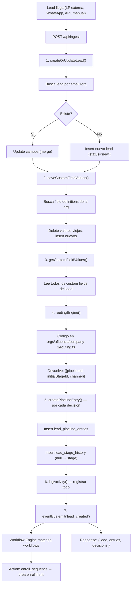
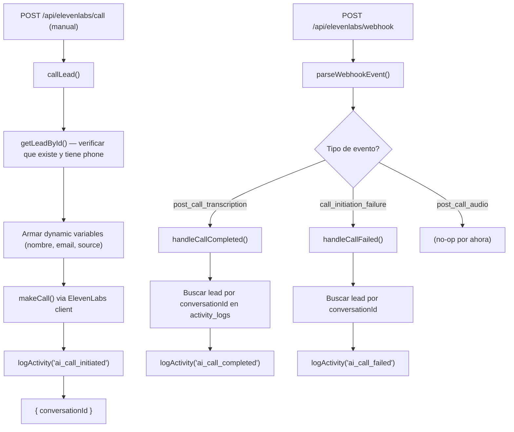
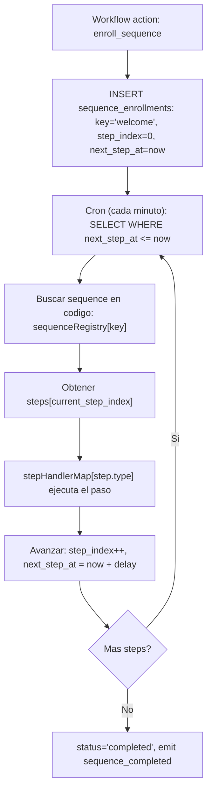

# v0 - Estado Actual del Codebase

> Referencia de vision futura: [VISION-ARCHITECTURE.md](VISION-ARCHITECTURE.md)

---

## 1. Que es v0

Es el punto de partida. Todo se configura a mano. La meta es **lanzar el primer producto (AI Faktory), aprender que funciona, y despues automatizar**.

No hay UI de admin, no hay builders, no hay templates. Hay codigo, una API, y Supabase.

---

## 2. Que esta construido vs que falta

### Implementado

| Componente | Status | Donde |
|---|---|---|
| Monorepo (NPM workspaces) | Listo | `apps/*`, `packages/*` |
| API Express | Listo | `apps/api/` |
| Web Next.js (placeholder) | Esqueleto | `apps/web/` |
| Supabase DB (11 tablas, schema `marketing`) | Listo | `packages/db/` |
| Types generados de Supabase | Listo | `packages/db/src/types.ts` |
| Config con Zod validation | Listo | `packages/config/` |
| Lead ingestion (POST /api/ingest) | Listo | `core/services/ingestion.service.ts` |
| Lead CRUD (create, update, dedup por email) | Listo | `core/services/lead.service.ts` |
| Custom fields (save + read) | Listo | `core/services/custom-field.service.ts` |
| Pipeline entries + stage history | Listo | `core/services/lead-pipeline.service.ts` |
| Activity logging | Listo | `core/services/activity-log.service.ts` |
| Routing engine por org (codigo puro) | Listo | `orgs/afluence/company-1/routing.ts` |
| Org config (IDs, statuses) | Listo | `orgs/afluence/company-1/config.ts` |
| Seed script (crear org/BU/pipeline/stages/fields) | Listo | `orgs/afluence/company-1/seed.ts` |
| ElevenLabs client (AI calls) | Listo | `packages/elevenlabs/` |
| ElevenLabs webhook + manual call trigger | Listo | `core/routes/elevenlabs.routes.ts` |
| AI call service (call lead, handle completed/failed) | Listo | `core/services/call.service.ts` |
| WhatsApp Cloud API client | Listo | `packages/whatsapp-client/` |
| Email client (Resend + React Email) | Listo | `packages/email/` |
| Code-first sequences (TS definitions) | Listo | `orgs/afluence/company-1/sequences/` |
| Code-first workflows (TS definitions) | Listo | `orgs/afluence/company-1/workflows/` |
| Org registry (aggregates all BU sequences/workflows) | Listo | `orgs/index.ts` |
| Event bus (PipelineEventBus) | Listo | `core/engine/event-bus.ts` |
| Sequence executor (cron, processes enrollments) | Listo | `core/engine/sequence-executor.ts` |
| Step handlers (whatsapp, email, ai_call, wait, manual) | Listo | `core/engine/step-handlers/` |
| Workflow engine (event-driven, matches code workflows) | Listo | `core/engine/workflow-engine.ts` |
| Action handlers (move_stage, update_status, enroll, etc) | Listo | `core/engine/action-handlers/` |
| Enrollment service (enroll, unenroll, pause, resume) | Listo | `core/services/enrollment.service.ts` |
| Enrollment endpoints (CRUD) | Listo | `core/routes/enrollment.routes.ts` |
| Move stage endpoint (PUT) | Listo | `core/routes/leads.routes.ts` |
| Cron job (sequence-step-processor, enabled) | Listo | `core/cron/jobs/index.ts` |
| List leads (GET /api/leads) | Listo | `core/routes/leads.routes.ts` |
| Lead detail (GET /api/leads/:id) | Listo | `core/routes/leads.routes.ts` |
| Zod validation middleware | Listo | `core/middleware/validate.ts` |
| Error handler middleware | Listo | `core/middleware/error-handler.ts` |

### No implementado todavia

| Componente | Prioridad | Notas |
|---|---|---|
| Asignar lead a pipeline manual (POST) | Alta | Falta endpoint |
| CRUD pipelines/stages via API | Media | Solo se crean via seed |
| CRUD custom field definitions via API | Media | Solo se crean via seed |
| Multi-BU routing (org registry for routes) | Media | Routes hardcodean company-1, resolver con segundo BU |
| Admin UI (apps/web) | Baja | Solo placeholder |
| Auth/API key middleware | Baja | No hay auth todavia |
| Paginacion en endpoints | Baja | Falta implementar |

---

## 3. Decisiones de Diseno

| Decision | Valor | Por que |
|---|---|---|
| **DB** | Supabase (PostgreSQL managed, schema `marketing`) | Sin ops, types auto-generados, escala sin esfuerzo |
| **ORM** | Supabase client directo (no Drizzle) | Simple, tipado gratis con gen-types, sin capas extra |
| **API** | Express 5 + TypeScript | Ligero, conocido, rapido de iterar |
| **Monorepo** | NPM workspaces (`apps/*` + `packages/*`) | Sin Turbo/Nx, minima complejidad |
| **Routing** | Codigo puro en `orgs/<org>/<bu>/routing.ts` | Maximo control. Cambiar = PR + deploy |
| **Config por org** | `orgs/<org>/<bu>/config.ts` con IDs hardcoded (de env vars) | Cada org/BU tiene sus IDs de pipeline/stages. El seed los crea, se copian al .env |
| **Custom fields** | Polimorficos (entity_type + entity_id, sin FK real) | Flexibilidad: un lead puede tener cualquier campo extra |
| **Email** | Unique por org. Dedup automatica en ingestion | Un email = un lead dentro de una org |
| **Landing pages** | Externas (Webflow, HTML, etc). POSTean a /api/ingest | No hay builder. Las LP son cualquier form que haga POST |
| **WhatsApp** | Client directo, sin colas | Suficiente para v0. Colas despues |
| **Workflows** | Code-first: definidos en TypeScript en `orgs/<org>/<bu>/workflows/` | Event-driven: cuando pasa X, hacer Y. Workflow engine escucha event bus |
| **Sequences** | Code-first: definidos en TypeScript en `orgs/<org>/<bu>/sequences/` | Cadencias de outreach: send, wait, call. Cron ejecuta enrollments cada minuto |
| **Automations** | "Si un humano lo escribe → codigo. Si el sistema lo genera → DB" | Definiciones en codigo, runtime (enrollments) en DB |
| **Un solo deploy** | Una API sirve todos los orgs | No hay un servicio por org. Solo un routing que apunta al org correcto |

---

## 4. API Endpoints (implementados)

```
GET    /api/health                              Health check + cron status

POST   /api/ingest                              Entrada principal de leads
                                                 → crea/actualiza lead
                                                 → guarda custom fields
                                                 → routing engine decide pipeline
                                                 → crea pipeline entry + stage history
                                                 → registra activity logs
                                                 → emite evento lead_created/lead_updated
                                                 → workflow engine puede auto-enrollar en secuencia

GET    /api/leads                               Lista leads de la org (afluence/company-1)
GET    /api/leads/:id                           Detalle: lead + custom fields + entries + activity + enrollments

PUT    /api/leads/:leadId/pipeline-entries/:entryId/stage
                                                 Mover lead entre stages (emite stage_entered/exited)

POST   /api/enrollments                         Enrollar lead en una secuencia
GET    /api/enrollments/:id                     Detalle de enrollment
DELETE /api/enrollments/:id                     Unenrollar lead
PATCH  /api/enrollments/:id/pause               Pausar enrollment
PATCH  /api/enrollments/:id/resume              Resumir enrollment
GET    /api/leads/:id/enrollments               Enrollments de un lead

POST   /api/elevenlabs/webhook                  Webhook de ElevenLabs (post-call events)
POST   /api/elevenlabs/call                     Trigger manual de AI call a un lead
```

### Payload de /api/ingest

```json
{
  "email": "juan@empresa.com",
  "firstName": "Juan",
  "lastName": "Perez",
  "phone": "+5491155554444",
  "source": "landing_page",
  "channel": "inbound",
  "sourceType": "landing_page",
  "sourceId": "uuid-opcional",
  "utmData": {
    "utm_source": "google",
    "utm_medium": "cpc",
    "utm_campaign": "black_friday_2026"
  },
  "customFields": {
    "company": "TechCorp",
    "role": "CTO",
    "company_size": "150",
    "interest": "AI tools"
  }
}
```

### Payload de /api/elevenlabs/call

```json
{
  "leadId": "uuid-del-lead",
  "orgId": "uuid-de-la-org",
  "pipelineEntryId": "uuid-opcional",
  "firstMessage": "Hola Juan, te llamo de AI Faktory...",
  "dynamicVariables": { "offer": "descuento 30%" },
  "agentId": "agent-id-opcional"
}
```

---

## 5. Flujo de Ingestion (implementado)



---

## 6. Flujo de AI Call (implementado)



---

## 7. Code-First Automations (como funciona)

### Regla: si un humano lo escribe, es codigo. Si el sistema lo genera, es database.

| Que | Donde | Ejemplo |
|---|---|---|
| Sequence definitions | Codigo (`orgs/<org>/<bu>/sequences/*.ts`) | Pasos: send_whatsapp → wait 48h → send_email → ai_call |
| Workflow definitions | Codigo (`orgs/<org>/<bu>/workflows/*.ts`) | "Cuando lead_created → enroll en welcome sequence" |
| Prompts, mensajes, templates | Codigo (dentro del step definition) | `{ message: "Hola {{lead_name}}..." }` |
| Routing logic | Codigo (`orgs/<org>/<bu>/routing.ts`) | "Todo lead → Pipeline Main, stage New Lead" |
| Pipeline/stages structure | DB (creado por seed, una vez) | Pipeline "Main", stages: New Lead → Contacted → ... |
| Leads, enrollments, logs | DB (el sistema los genera en runtime) | Lead juan@email.com, enrollment en "welcome", activity logs |

### Flujo de una secuencia



### Para cambiar un prompt o mensaje

Editar el archivo `.ts` en `orgs/<org>/<bu>/sequences/`, push, deploy. No hay que tocar la DB, no hay frontend, no hay CRUD.

---

## 8. Services Implementados

| Service | Archivo | Que hace |
|---|---|---|
| **ingestion** | `core/services/ingestion.service.ts` | Orquesta: lead → custom fields → routing → pipeline → logs → emit evento |
| **lead** | `core/services/lead.service.ts` | `createOrUpdateLead()` (dedup por email), `getLeadById()`, `getLeadsByOrg()` |
| **lead-pipeline** | `core/services/lead-pipeline.service.ts` | `createPipelineEntry()`, `moveStage()` (+ history + events), `getEntriesForLead()` |
| **custom-field** | `core/services/custom-field.service.ts` | `saveCustomFieldValues()` (upsert), `getCustomFieldValues()` |
| **activity-log** | `core/services/activity-log.service.ts` | `logActivity()`, `getActivityForLead()` |
| **call** | `core/services/call.service.ts` | `callLead()`, `handleCallCompleted()`, `handleCallFailed()` + emite eventos |
| **enrollment** | `core/services/enrollment.service.ts` | `enrollLead()`, `unenrollLead()`, `pauseEnrollment()`, `resumeEnrollment()` |

### Engine (core/engine/)

| Componente | Archivo | Que hace |
|---|---|---|
| **event-bus** | `core/engine/event-bus.ts` | EventEmitter tipado. Services emiten, workflow engine escucha |
| **workflow-engine** | `core/engine/workflow-engine.ts` | Escucha eventos, matchea workflows del registry, ejecuta actions |
| **sequence-executor** | `core/engine/sequence-executor.ts` | Cron lo llama, procesa enrollments con `next_step_at <= now()` |
| **step-handlers** | `core/engine/step-handlers/` | send_whatsapp, send_email, ai_call, wait, manual_task |
| **action-handlers** | `core/engine/action-handlers/` | move_stage, update_status, enroll_sequence, unenroll_sequence, log, notify |

---

## 9. Packages

| Package | Path | Que hace |
|---|---|---|
| **@marketing-pipeline/config** | `packages/config/` | Lee `.env` + `.env.local`, valida con Zod, exporta `env` tipado |
| **@marketing-pipeline/db** | `packages/db/` | Supabase client (`supabaseAnon`, `supabaseAdmin`), types generados |
| **@marketing-pipeline/elevenlabs** | `packages/elevenlabs/` | Client de ElevenLabs Conversational AI: calls, agents, conversations, webhooks |
| **@marketing-pipeline/whatsapp-client** | `packages/whatsapp-client/` | WhatsApp Cloud API: send messages, webhook verification/parsing |
| **@marketing-pipeline/email** | `packages/email/` | Resend: send emails, React Email templates, bulk sending |

---

## 10. Como agregar un nuevo producto (proceso manual v0)

### Paso 1: Crear la carpeta de org/BU

Estructura: `apps/api/src/orgs/<org-name>/<bu-name>/` con archivos de config + automations:

```
orgs/afluence/faktory-creators/
├── config.ts                    IDs + org settings
├── routing.ts                   Routing logic
├── seed.ts                      Crear org/BU/pipeline/stages en DB
├── sequences/
│   ├── index.ts                 Exporta todas las secuencias
│   └── welcome-creators.ts     Secuencia de bienvenida
└── workflows/
    ├── index.ts                 Exporta todos los workflows
    └── auto-enroll.ts           Auto-enroll en secuencia al crear lead
```

### Paso 2: Definir secuencias (TypeScript)

```typescript
// sequences/welcome-creators.ts
import type { SequenceDef } from '../../../../core/types';

export const welcomeCreators: SequenceDef = {
  key: 'welcome-creators',
  name: 'Welcome Creators',
  steps: [
    { type: 'send_whatsapp', message: 'Hola {{lead_name}}, bienvenido a Faktory...' },
    { type: 'wait', hours: 48 },
    { type: 'send_email', template: 'creators-followup', subject: 'No te pierdas esto' },
    { type: 'wait', hours: 24 },
    { type: 'ai_call', agentId: 'xxx', firstMessage: 'Hola {{lead_name}}...' },
  ],
};
```

### Paso 3: Definir workflows (TypeScript)

```typescript
// workflows/auto-enroll.ts
import type { WorkflowDef } from '../../../../core/types';

export const autoEnroll: WorkflowDef = {
  key: 'creators-auto-enroll',
  name: 'Auto-enroll new creators',
  trigger: { event: 'lead_created', conditions: { source: 'landing_creators' } },
  actions: [{ type: 'enroll_sequence', sequenceKey: 'welcome-creators' }],
};
```

### Paso 4: Registrar en el registry

Agregar al `orgs/index.ts`:
```typescript
import { sequences as creatorsSeqs } from './afluence/faktory-creators/sequences';
import { workflows as creatorsWfs } from './afluence/faktory-creators/workflows';
// ...spread into sequenceRegistry and workflowRegistry
```

### Paso 5: Ejecutar seed + configurar env

```bash
npx ts-node src/orgs/afluence/faktory-creators/seed.ts
# Copiar los IDs al .env.local
```

### Paso 6: Conectar la landing page

Cualquier form que haga POST a `/api/ingest` con el payload correcto. La secuencia y los workflows se ejecutan automaticamente.

---

## 11. DB: Schema y Types

Las tablas viven en Supabase bajo el schema `marketing`. Los types se generan automaticamente:

```bash
# Desde apps/api:
npm run gen-types
# Esto corre supabase gen types y genera packages/db/src/types.ts
```

El archivo `packages/db/src/types.ts` contiene tipos `Row`, `Insert`, `Update` para cada tabla. Todos los services usan estos tipos via el Supabase client (tipado automatico).

### Tablas existentes (11)

> Sequence/workflow **definitions** viven en codigo TypeScript. La DB solo guarda runtime data.

| Tabla | Campos clave | Tipo |
|---|---|---|
| **organizations** | id, name | Estructura (seed) |
| **business_units** | organization_id, name, description | Estructura (seed) |
| **pipelines** | business_unit_id, name, description, is_active | Estructura (seed) |
| **pipeline_stages** | pipeline_id, name, position | Estructura (seed) |
| **custom_field_definitions** | organization_id, entity_type, field_key, field_label, field_type | Estructura (seed) |
| **leads** | organization_id, email (unique), first_name, last_name, phone, source, status | Runtime |
| **lead_pipeline_entries** | lead_id, pipeline_id, current_stage_id, channel, trigger_type, utm_data | Runtime |
| **lead_stage_history** | lead_pipeline_entry_id, from_stage_id, to_stage_id, changed_at | Runtime |
| **custom_field_values** | entity_type, entity_id, field_definition_id, value | Runtime |
| **sequence_enrollments** | sequence_key, organization_id, lead_id, current_step_index, status, next_step_at | Runtime |
| **activity_logs** | organization_id, lead_id, lead_pipeline_entry_id, action, metadata | Runtime |

---

## 12. Estructura Completa del Proyecto

```
marketing-funnel/
├── package.json                          workspaces: ["packages/*", "apps/*"]
├── tsconfig.base.json
├── .env.example
├── .env.local
│
├── apps/
│   ├── api/                              @marketing-funnel/api
│   │   ├── package.json
│   │   ├── scripts/
│   │   │   └── gen-types.sh              Genera types desde Supabase
│   │   └── src/
│   │       ├── index.ts                  Express app + startup (cron + workflow engine)
│   │       │
│   │       ├── core/                     ← Plataforma compartida
│   │       │   ├── types/
│   │       │   │   └── index.ts          RoutingEngine, SequenceDef, WorkflowDef, PipelineEvent
│   │       │   ├── routes/
│   │       │   │   ├── ingestion.routes.ts   POST /api/ingest
│   │       │   │   ├── leads.routes.ts       Leads CRUD + move stage
│   │       │   │   ├── enrollment.routes.ts  Enrollment CRUD
│   │       │   │   └── elevenlabs.routes.ts  Webhook + manual call
│   │       │   ├── services/
│   │       │   │   ├── ingestion.service.ts  Orquestador + emit lead_created
│   │       │   │   ├── lead.service.ts       CRUD leads + dedup
│   │       │   │   ├── lead-pipeline.service.ts  Entries + moveStage + events
│   │       │   │   ├── enrollment.service.ts Enroll/unenroll/pause/resume
│   │       │   │   ├── custom-field.service.ts
│   │       │   │   ├── activity-log.service.ts
│   │       │   │   └── call.service.ts       AI calls + emit events
│   │       │   ├── engine/               ← Automation engine
│   │       │   │   ├── event-bus.ts          PipelineEventBus (EventEmitter tipado)
│   │       │   │   ├── workflow-engine.ts    Escucha eventos, matchea workflows
│   │       │   │   ├── sequence-executor.ts  Procesa enrollments (cron)
│   │       │   │   ├── step-handlers/        send_whatsapp, send_email, ai_call, wait, manual_task
│   │       │   │   └── action-handlers/      move_stage, update_status, enroll/unenroll, log, notify
│   │       │   ├── middleware/
│   │       │   │   ├── validate.ts
│   │       │   │   └── error-handler.ts
│   │       │   └── cron/
│   │       │       ├── index.ts
│   │       │       ├── scheduler.ts
│   │       │       └── jobs/index.ts         sequence-step-processor (enabled, every minute)
│   │       │
│   │       └── orgs/                     ← Config + automations por org/BU
│   │           ├── index.ts              Registry (agrega sequences + workflows de todos los BUs)
│   │           └── afluence/
│   │               └── company-1/
│   │                   ├── config.ts     IDs + org settings
│   │                   ├── routing.ts    Routing logic
│   │                   ├── seed.ts       DB seed script
│   │                   ├── sequences/    Sequence definitions (TS)
│   │                   │   ├── index.ts
│   │                   │   └── welcome.ts
│   │                   └── workflows/    Workflow definitions (TS)
│   │                       ├── index.ts
│   │                       └── auto-enroll.ts
│   │
│   └── web/                              @marketing-funnel/web (Next.js 15, placeholder)
│
├── packages/
│   ├── config/                           Env vars + Zod validation
│   ├── db/                               Supabase client + generated types
│   ├── elevenlabs/                       ElevenLabs Conversational AI
│   ├── whatsapp-client/                  WhatsApp Cloud API
│   └── email/                            Resend + React Email
│
├── supabase/
│   └── migrations/                       SQL migrations
│
└── docs/
    ├── VISION-ARCHITECTURE.md
    └── MVP-ARCHITECTURE.md               Este archivo
```

---

## 13. Ejemplo End-to-End (lo que funciona hoy)

```
1. SETUP PREVIO (ya hecho para afluence/company-1):
   - Seed crea: Organization "Afluence" + BU "Company-1" + Pipeline "Main Pipeline"
     + Stages: New Lead → Contacted → Qualified → Converted
     + Custom fields: company, role, company_size, industry, interest
   - IDs en .env: PROJECT1_ORG_ID, PROJECT1_PIPELINE_ID, PROJECT1_STAGE_*

2. LEAD LLEGA:
   Landing page externa envia:
   POST /api/ingest {
     "email": "juan@techcorp.com",
     "firstName": "Juan",
     "phone": "+5491155554444",
     "source": "landing_page",
     "channel": "inbound",
     "utmData": { "utm_campaign": "black_friday" },
     "customFields": { "company": "TechCorp", "role": "CTO", "company_size": "150" }
   }

3. SISTEMA PROCESA:
   → createOrUpdateLead(): busca por email, no existe → crea lead (status=new)
   → saveCustomFieldValues(): guarda company, role, company_size
   → routingEngine(): afluence/company-1 routing → Pipeline "Main Pipeline", stage "New Lead"
   → createPipelineEntry(): entry + stage history (null → New Lead)
   → logActivity(): 'lead.routed_to_pipeline' + 'lead.created'
   → eventBus.emit({ type: 'lead_created', ... })

4. WORKFLOW ENGINE REACCIONA:
   → Detecta evento 'lead_created'
   → Matchea workflow 'company1-auto-enroll' (trigger: lead_created)
   → Ejecuta action: enroll_sequence('company1-welcome')
   → Crea sequence_enrollment: lead + sequence, step_index=0, next_step_at=now

5. CRON EJECUTA SECUENCIA (cada minuto):
   → Encuentra enrollment con next_step_at <= now
   → Step 0: send_whatsapp → envia WhatsApp al lead
   → Avanza a step 1 (wait 48h) → next_step_at = now + 48h
   → ...48h despues...
   → Step 2: send_email → envia email
   → Step 3: wait 24h
   → Step 4: ai_call → ElevenLabs llama al lead
   → Secuencia completada → emite 'sequence_completed'

6. VERIFICAR:
   GET /api/leads/:id
   → { lead, customFields, pipelineEntries, activity, enrollments }

7. MOVER STAGE (manual o via workflow):
   PUT /api/leads/:leadId/pipeline-entries/:entryId/stage { "stageId": "uuid" }
   → Mueve lead de New Lead → Contacted
   → Emite stage_exited + stage_entered (otro workflow puede reaccionar)
```

---

## 14. Proximos pasos inmediatos

1. **Aplicar migration** — Correr `20250224100000_code_first_automations.sql` en Supabase + regenerar types
2. **Segundo BU real** — Crear `orgs/afluence/faktory-creators/` con secuencias y workflows reales
3. **Multi-BU routing** — Resolver wiring para que multiples BUs funcionen en paralelo
4. **Admin UI minimo** — Vista de leads + pipelines + enrollments en `apps/web`
5. **Email templates** — Crear templates reales en `packages/email/` para las secuencias
6. **Testing** — Test end-to-end del flujo: ingest → workflow → sequence → WhatsApp/email/call
7. **Auth/API keys** — Proteger endpoints
