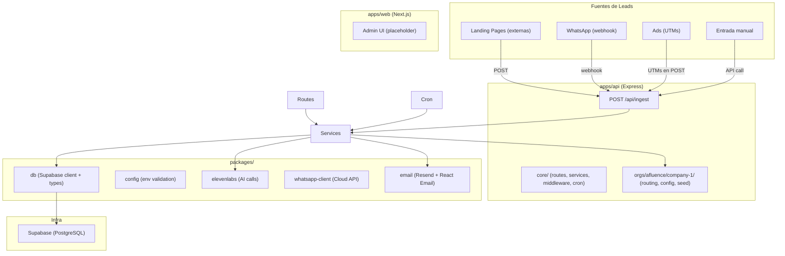
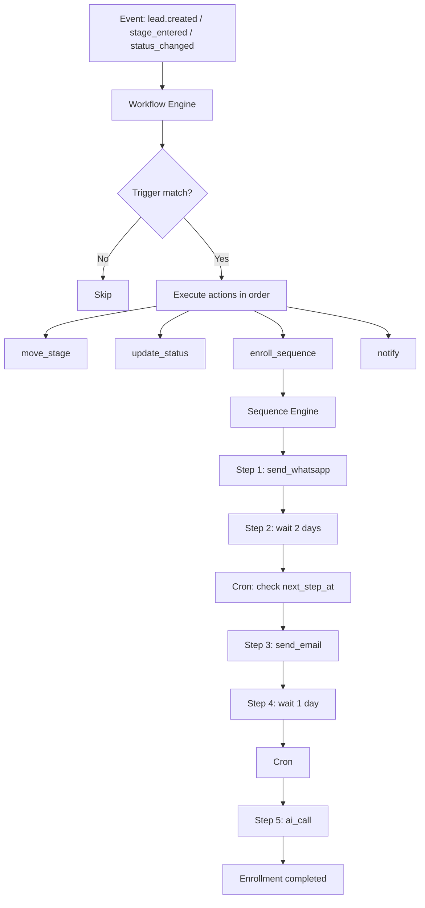
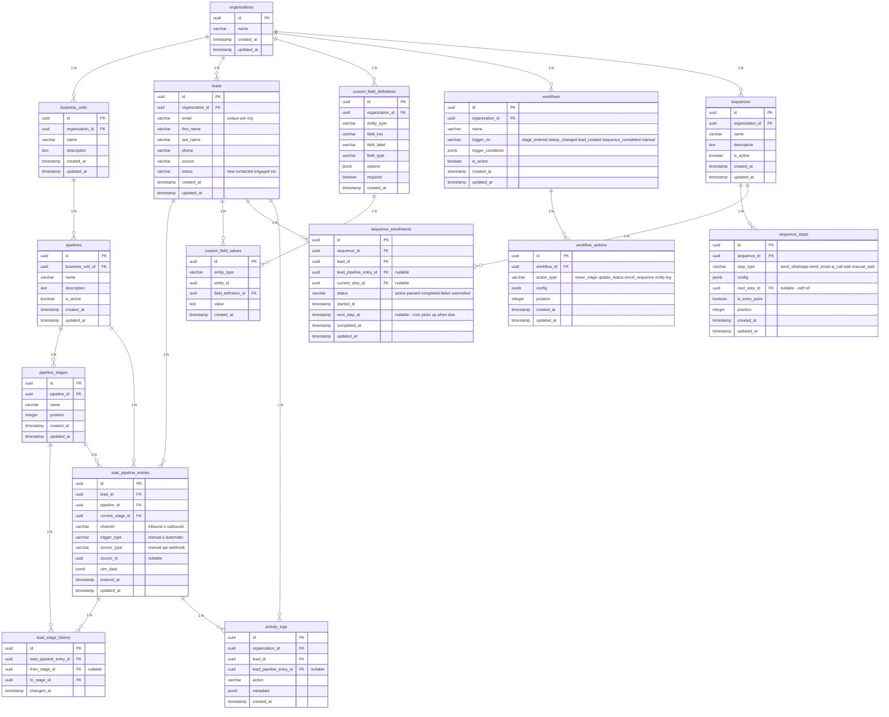
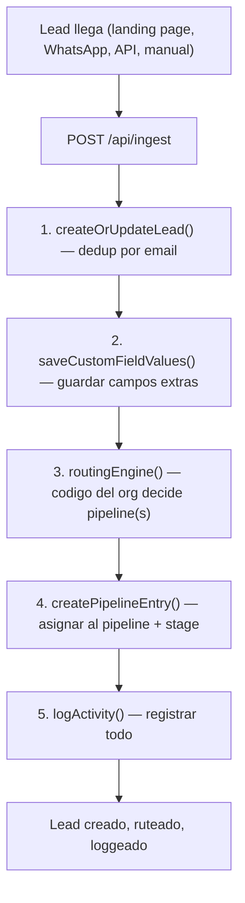

# Vision - Marketing Pipeline Infrastructure

> La infraestructura interna de Afluence para lanzar, testear y escalar pipelines de marketing end-to-end.

---

## 1. Que es esto

NO es un SaaS. NO es multi-tenant. NO es HubSpot.

Es **nuestra herramienta interna** — un HubSpot + n8n LIGHT, hecho a medida, para lanzar y operar pipelines de marketing para nuestros propios productos y los de nuestros clientes.

### La evolucion

```
v0 (HOY)          → Todo manual. Aprender. Configurar cada producto a mano.
v1 (semanas)       → Mas productos, mas pipelines, patrones claros. Empezar a automatizar.
v2 (meses)         → SDK/API para crear pipelines programaticamente. Templates.
v3 (vision)        → Un agente AI puede crear landing + pipeline + automations + A/B test en minutos.
```

### Productos que van a correr sobre esta infra

| Producto | Que vende | A quien | Status |
|---|---|---|---|
| **AI Faktory** | Software, apps, herramientas AI | Creators y empresas | Primero, ya configurado |
| **Producto 2** (TBD) | Ads + pipeline automations | TBD | Semanas |
| **Productos de clientes** | Variable | Variable | Futuro cercano |

Cada producto nuevo = crear su carpeta en `orgs/`, definir su routing, sus pipelines, su config. Deploy. Listo.

---

## 2. Principios

| Principio | Que significa |
|---|---|
| **Manual primero** | Cada producto nuevo se configura a mano. No hay UI de "crear pipeline". Se aprende con cada uno |
| **Un solo deploy** | Una API, una web app. No microservicios. No un servicio por org |
| **Supabase como DB** | PostgreSQL managed. Auth, storage, realtime gratis si los necesitamos |
| **Org como namespace** | `organization_id` aisla datos entre productos. No es multi-tenancy real, es organizacion logica |
| **Codigo > config** | Routing, handlers, listas de estados — todo en codigo TypeScript. Cambiar = PR + deploy |
| **Monorepo simple** | NPM workspaces. `apps/` para deployables, `packages/` para librerias compartidas |

---

## 3. Arquitectura Actual (v0)



### Stack real

| Componente | Tecnologia |
|---|---|
| API | Express 5 + TypeScript |
| Web | Next.js 15 + React 19 (placeholder) |
| DB | Supabase (PostgreSQL, schema `marketing`) |
| Types | Generados desde Supabase (`gen-types.sh`) |
| Email | Resend + React Email templates |
| AI Calls | ElevenLabs Conversational AI |
| WhatsApp | WhatsApp Cloud API (direct, sin colas) |
| Config | Zod validation para env vars |
| Monorepo | NPM workspaces |
| Deploy | TBD (Railway o similar) |

---

## 4. Automation: Workflows + Sequences

Dos conceptos distintos que trabajan juntos:



| | Workflow | Sequence |
|---|---|---|
| **Rol** | El cerebro. Reacciona a eventos, decide que hacer | Las manos. Cadencia de outreach en el tiempo |
| **Ejecucion** | Instantanea (sin delays) | En el tiempo (con waits entre steps) |
| **Pertenece a** | organization_id | organization_id |
| **Se activa por** | Eventos: stage_entered, status_changed, lead_created, sequence_completed, manual | Un workflow con accion `enroll_sequence`, o enrollment manual |
| **Que hace** | Acciones: move_stage, update_status, enroll_sequence, notify, log | Steps: send_whatsapp, send_email, ai_call, wait, manual_task |
| **Por lead** | No — se evalua por evento, ejecuta acciones | Si — un lead esta "enrolled" y avanza por los steps |

**Ejemplo concreto:**

Workflow "Qualify Enterprise Leads":
```
WHEN: lead.custom_field_changed (role = CTO AND company_size >= 50)
THEN:
  → move_stage: "Qualified"
  → update_status: "MQL"
  → enroll_sequence: "Enterprise Nurturing"
```

Sequence "Enterprise Nurturing":
```
Step 1: send_whatsapp "Hola {name}, gracias por tu interes..."
Step 2: wait 2 days
Step 3: send_email "Queria darte mas info sobre..."
Step 4: wait 1 day
Step 5: ai_call (ElevenLabs agent)
```

---

## 5. Modelo de Datos (15 tablas)

Schema: `marketing` en Supabase.



### Tablas por bloque

| Bloque | Tablas | Para que |
|---|---|---|
| **Core** | organizations, business_units, pipelines, pipeline_stages | Estructura organizativa. Org > BU > Pipeline > Stages |
| **Leads** | leads, lead_pipeline_entries, lead_stage_history, custom_field_definitions, custom_field_values | Datos de leads, en que pipeline estan, historial de movimiento, campos custom |
| **Workflows** | workflows, workflow_actions | Automatizacion event-driven: cuando pasa X, hacer Y (instantaneo) |
| **Sequences** | sequences, sequence_steps, sequence_enrollments | Cadencias de outreach: send, wait, call (en el tiempo, por lead) |
| **Tracking** | activity_logs | Registro de toda accion del sistema |

---

## 6. Flujo Principal: Lead Ingestion



El routing engine es **codigo puro** definido por cada org en `apps/api/src/orgs/<org>/routing.ts`. Evalua los custom fields del lead y decide a que pipeline va.

---

## 7. Estructura del Proyecto

```
marketing-pipeline/
├── package.json                          Monorepo root (NPM workspaces)
├── tsconfig.base.json                    Config TS compartida
├── .env.example / .env.local             Variables de entorno
│
├── apps/
│   ├── api/                              Express API (el corazon)
│   │   ├── src/
│   │   │   ├── index.ts                  Entry point + Express setup
│   │   │   ├── core/                     Plataforma compartida
│   │   │   │   ├── types/index.ts        RoutingEngine, OrgConfig, HandlerMaps
│   │   │   │   ├── routes/               ingestion, leads, elevenlabs
│   │   │   │   ├── services/             ingestion, lead, pipeline, call, etc.
│   │   │   │   ├── middleware/           validate, error-handler
│   │   │   │   └── cron/                 Cron scheduler + jobs
│   │   │   └── orgs/                     Config por org/BU
│   │   │       └── afluence/             Organization
│   │   │           └── company-1/        Business Unit
│   │   │               ├── config.ts     IDs, statuses, timezone
│   │   │               ├── routing.ts    Logica de routing
│   │   │               └── seed.ts       Script para crear data inicial
│   │   ├── scripts/
│   │   │   └── gen-types.sh              Genera types desde Supabase
│   │   └── package.json
│   │
│   └── web/                              Next.js 15 (placeholder)
│       └── ...
│
├── packages/
│   ├── config/                           Env vars con Zod validation
│   ├── db/                               Supabase client (anon + admin) + generated types
│   ├── elevenlabs/                       ElevenLabs Conversational AI client
│   ├── whatsapp-client/                  WhatsApp Cloud API client
│   └── email/                            Resend + React Email templates
│
└── docs/
    ├── VISION-ARCHITECTURE.md            Este archivo
    └── MVP-ARCHITECTURE.md               Estado actual detallado
```

### Como agregar un nuevo producto/org/BU

1. Crear carpeta en `apps/api/src/orgs/<org>/<bu>/`
2. Definir `config.ts` (IDs, statuses, timezone) — imports from `../../../core/types`
3. Definir `routing.ts` (a que pipeline va cada lead) — imports from `../../../core/types`
4. Crear `seed.ts` (org, BU, pipeline, stages, custom fields en Supabase)
5. Ejecutar seed, copiar IDs al `.env`
6. Wiring: conectar el routing del nuevo org/BU en `core/routes/` (o hacer registry dinamico cuando haya mas de uno)

---

## 8. Roadmap de Evolucion

### v0 — Donde estamos (manual, aprender)

- [x] Monorepo con apps/api + apps/web
- [x] Supabase con 15 tablas (schema `marketing`)
- [x] Lead ingestion con routing por org
- [x] Custom fields, pipeline entries, stage history, activity logs
- [x] ElevenLabs integration (AI calls)
- [x] WhatsApp client
- [x] Email client (Resend)
- [x] Primer org configurado (afluence/company-1)
- [x] Estructura `core/` + `orgs/<org>/<bu>/` para escalabilidad
- [x] Workflows + Sequences architecture (tablas creadas, ejecucion pendiente)
- [ ] Completar CRUD endpoints (pipelines, stages, sequences, workflows)
- [ ] Sequence execution (cron: pick up enrollments, execute steps, advance)
- [ ] Workflow engine (event listener: evaluate triggers, execute actions)
- [ ] Mas routes para leads (mover stage, asignar a pipeline manual)
- [ ] Admin UI basico en apps/web
- [ ] Segundo producto (AI Faktory con config real)

### v1 — Mas productos, patrones claros

- [ ] 2-3 productos corriendo con pipelines distintos
- [ ] Templates de pipelines reutilizables
- [ ] Sequence execution con delays (cron con next_step_at)
- [ ] Email como sequence step (send_email via Resend)
- [ ] WhatsApp outbound como sequence step (send_whatsapp via Cloud API)
- [ ] AI calls como sequence step (ai_call via ElevenLabs)
- [ ] Workflow engine ejecutando acciones (move_stage, enroll_sequence, etc.)
- [ ] Dashboard basico (leads, pipelines, sequences, activity)
- [ ] ICP scoring (evaluar leads contra perfiles ideales)

### v2 — Automatizar la creacion

- [ ] API/SDK para crear pipelines programaticamente
- [ ] Templates de landing pages
- [ ] Config de org via API (no solo codigo)
- [ ] Webhooks genericos (recibir leads de cualquier fuente)
- [ ] A/B testing de landing pages
- [ ] Metricas de conversion por pipeline/stage

### v3 — La vision: AI-powered pipeline factory

```
Imagina esto:

Un agente AI dice:
"Tengo una idea para testear. Voy a crear:
  - Una landing page para vender X a Y
  - Un pipeline con 4 stages
  - Una sequence de nurturing (email dia 1, WhatsApp dia 3, AI call dia 7)
  - Workflows que mueven leads entre stages automaticamente
  - UTMs configurados
  - A/B testing con 3 variaciones de landing
  Todo listo para lanzar."

Y lo hace. Programaticamente. Via MCP o SDK.
10 ideas por dia. Medir. Iterar. Escalar las que funcionan.
```

Esto es lo que construimos. Pero para llegar ahi, primero tenemos que:
1. Operar manualmente (v0) — entender que necesitamos
2. Automatizar patrones (v1-v2) — abstraer lo repetitivo
3. Abrir la API (v3) — dejar que agentes creen pipelines

---

## 9. Que NO es esto (clarificaciones)

| NO es | Por que |
|---|---|
| Multi-tenant SaaS | No vendemos esta plataforma. Es nuestra herramienta interna |
| Microservicios | Un solo deploy de API. Packages son librerias, no servicios independientes |
| Deploy por org | Un solo API sirve todos los productos. Routing en codigo decide que logica aplicar |
| HubSpot completo | Es LIGHT. Solo lo que necesitamos. Crece con nosotros |
| Produccion-ready | Es v0. Estamos aprendiendo. Se va a romper y refactorear muchas veces |
