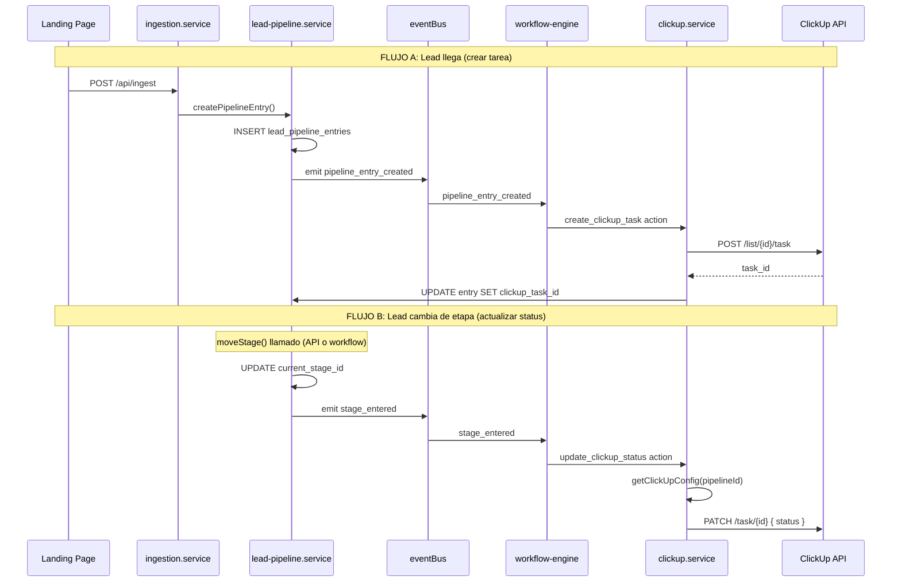

# Integración ClickUp con el Funnel — Plan Detallado

Arquitectura detallada: integración ClickUp, flujo de ventas Afluence (stages, sequences, workflows), migración del landing y orden de implementación.

---

## 1. Flujo completo (secuencia de eventos)



---

## 2. Separación: integración genérica vs org-specific

| Capa | Ubicación | Alcance |
|------|------------|---------|
| **Integración (genérica)** | `packages/clickup-client`, `core/services/clickup.service.ts`, `core/engine/action-handlers/` | Disponible para TODAS las organizaciones y BUs. Código reutilizable. |
| **Registry** | `orgs/index.ts` | Agrega configs de los BUs que tienen ClickUp habilitado. |
| **Config** | `orgs/<org>/<bu>/config.ts` | Cada BU define su `clickup` (listId, stageToStatusMap, token). |
| **Workflows** | `orgs/<org>/<bu>/workflows/clickup-sync.ts` | Los workflows son **por BU**. Solo Afluence BU1 los tiene hoy. |

**Resumen**: La integración en sí es global. La activación y el comportamiento son por BU: config + workflows.

---

## 3. Estructura de archivos

```
packages/
  clickup-client/                    # Nuevo paquete
    package.json
    tsconfig.json
    src/
      index.ts
      client.ts
      types.ts

packages/config/
  src/
    env.ts                           # + CLICKUP_API_TOKEN, PROJECT1_CLICKUP_API_TOKEN

apps/api/src/
  core/
    services/
      clickup.service.ts             # NUEVO
    engine/
      action-handlers/
        create-clickup-task.ts       # NUEVO
        update-clickup-status.ts     # NUEVO
        index.ts
  orgs/
    index.ts                         # + clickUpConfigRegistry
    afluence/
      business-unit-1/
        config.ts                    # + clickup?: ClickUpConfig
        workflows/
          clickup-sync.ts            # NUEVO
          index.ts
```

---

## 4. Paquete `packages/clickup-client`

### 4.1 `client.ts`

```ts
const BASE_URL = 'https://api.clickup.com/api/v2';

export interface ClickUpClientConfig {
  apiToken: string;
}

export interface CreateTaskPayload {
  name: string;
  description?: string;
  status?: string;
  assignees?: number[];
  priority?: number;
}

export interface UpdateTaskPayload {
  name?: string;
  description?: string;
  status?: string;
  assignees?: number[];
  priority?: number;
}

export class ClickUpClient {
  constructor(private config: ClickUpClientConfig) {}

  private async request<T>(method: string, path: string, body?: object): Promise<T> {
    const res = await fetch(`${BASE_URL}${path}`, {
      method,
      headers: {
        'Authorization': this.config.apiToken,
        'Content-Type': 'application/json',
      },
      body: body ? JSON.stringify(body) : undefined,
    });
    if (!res.ok) throw new Error(`ClickUp API error: ${res.status} ${await res.text()}`);
    return res.json();
  }

  async createTask(listId: string, payload: CreateTaskPayload): Promise<{ id: string }> {
    const task = await this.request<{ id: string }>('POST', `/list/${listId}/task`, payload);
    return task;
  }

  async updateTask(taskId: string, payload: UpdateTaskPayload): Promise<void> {
    await this.request('PATCH', `/task/${taskId}`, payload);
  }

  async getTask(taskId: string): Promise<{ id: string; status: { status: string } }> {
    return this.request('GET', `/task/${taskId}`);
  }
}
```

---

## 5. Registry y tipos

### Tipos en `core/types/index.ts`

```ts
export interface ClickUpConfig {
  listId: string;
  stageToStatusMap: Record<string, string>;
  apiTokenEnvKey?: string;
}

export interface OrgConfig {
  // ... existing
  clickup?: ClickUpConfig;
}
```

### Registry en `orgs/index.ts`

```ts
import { config as bu1Config, IDS as bu1Ids } from './afluence/business-unit-1/config';

export const clickUpConfigRegistry: Record<string, ClickUpConfig> = {};
if (bu1Config.clickup && bu1Ids.pipelineId) {
  clickUpConfigRegistry[bu1Ids.pipelineId] = bu1Config.clickup;
}
```

---

## 6. Servicio `clickup.service.ts`

Ver plan completo para el código de `createTaskForEntry` y `updateTaskStatus`. Resumen:

- `getClickUpConfig(pipelineId)` — resuelve config + token desde env
- `createTaskForEntry(entryId, pipelineId, initialStageId, lead)` — crea tarea, guarda `clickup_task_id`
- `updateTaskStatus(entryId, pipelineId, stageId)` — actualiza status en ClickUp

---

## 7. Evento `pipeline_entry_created`

- Añadir `organizationId` a `CreateEntryInput` en `lead-pipeline.service.ts`
- Emitir `pipeline_entry_created` tras insertar entry
- Añadir tipo en `WorkflowEventType`

---

## 8. Action handlers

- `create_clickup_task`: recibe event con `pipelineEntryId`, `metadata.pipelineId`, `metadata.stageId`
- `update_clickup_status`: recibe event con `pipelineEntryId`, `metadata.stageId`, `metadata.pipelineId`
- Registrar ambos en `action-handlers/index.ts`

---

## 9. Workflows de ClickUp

```ts
// workflows/clickup-sync.ts
export const createClickUpTaskWorkflow: WorkflowDef = {
  key: 'company1-clickup-create-task',
  name: 'Create ClickUp task when lead enters pipeline',
  trigger: { event: 'pipeline_entry_created', conditions: {} },
  actions: [{ type: 'create_clickup_task' }],
};

export const updateClickUpStatusWorkflow: WorkflowDef = {
  key: 'company1-clickup-update-status',
  name: 'Update ClickUp task status when lead moves stage',
  trigger: { event: 'stage_entered', conditions: {} },
  actions: [{ type: 'update_clickup_status' }],
};
```

---

## 10. Config y env

- `config.ts`: `clickup` con `listId`, `stageToStatusMap`, `apiTokenEnvKey`
- `.env`: `CLICKUP_API_TOKEN`, `CLICKUP_LIST_ID`, `PROJECT1_CLICKUP_API_TOKEN`
- Migración SQL: `ALTER TABLE marketing.lead_pipeline_entries ADD COLUMN clickup_task_id varchar(255) NULL`

---

## 11. Mapeo del flujo de ventas Afluence

### Conceptos

- **Pipeline stages**: Etapas por las que pasa el lead (DB)
- **Sequences**: Cadencias de outreach (send_whatsapp, wait, ai_call) ejecutadas por el cron
- **Workflows**: Reaccionan a eventos y ejecutan acciones (enroll_sequence, move_stage, update_clickup_status)

**Importante:** Completar el formulario en el landing = agendar la llamada. No son pasos separados.

### Etapas del funnel

| Etapa | Pipeline Stage | Descripción |
|-------|----------------|-------------|
| Form completo (agendó llamada) | `llamada_agendada` | Completar form = agendar reunión |
| Formulario Parcial | `formulario_parcial` | Lead completó solo datos de contacto |
| Lead Pixel | `pixel_retargeting` | Sin datos de contacto, retargeting |
| Reunión Agendada | `reunion_agendada` | Tras flujo nurturing |
| Contactado | `contactado` | Tras llamada/recordatorio |
| Calificado | `calificado` | Lead calificado post-reunión |
| Convertido | `convertido` | Cierre |

### Secuencias

| Secuencia | Flujo | Steps |
|-----------|-------|-------|
| `llamada-agendada` | Nurturing Llamada Agendada | 1. Confirmación + link → 2. Casos de éxito → 3. Confirmación asistencia |
| `agendar-llamar` | Flujo Agendar Llamar | 1. WhatsApp + Llamada EL → 2 días → 2. Recordatorio → 3 días → 3. Eleven Labs |

### Custom fields

| Campo | Uso en routing |
|-------|----------------|
| `form_type` | `full` → llamada_agendada; `partial` → formulario_parcial; `none` → pixel_retargeting |
| `landing_page` | Landing 1, 2, 3 |
| `source` | Web, Instagram, TikTok, Ads, etc. |

---

## 12. Workflows recomendados

| # | Workflow | Event | Acciones |
|---|----------|-------|----------|
| 1 | routing-inicial | routing.ts | `initialStageId` según `form_type` |
| 2 | enroll-llamada-agendada | stage_entered | enroll_sequence llamada-agendada |
| 3 | enroll-agendar-llamar | stage_entered | enroll_sequence agendar-llamar |
| 4 | clickup-create-task | pipeline_entry_created | create_clickup_task |
| 5 | clickup-update-status | stage_entered | update_clickup_status |
| 6 | pixel-webhook (futuro) | stage_entered | webhook a pixel |

### Routing en `routing.ts`

```ts
export const routingEngine: RoutingEngine = (_lead, customFields, _source) => {
  const formType = customFields?.form_type as string | undefined;
  let initialStageId = IDS.stages.new_lead;
  if (formType === 'full') initialStageId = IDS.stages.llamada_agendada;
  else if (formType === 'partial') initialStageId = IDS.stages.formulario_parcial;
  else if (formType === 'none') initialStageId = IDS.stages.pixel_retargeting;
  return [{ pipelineId: IDS.pipelineId, initialStageId, channel: 'inbound' }];
};
```

---

## 13. Migración del landing "Landing page para Afluence"

### Origen y destino

| Origen | Destino |
|--------|---------|
| `Landing page para Afluence/` (Vite + React) | `apps/web/src/app/(landings)/afluence/business-unit-1/` |

### Integración con el funnel

- POST a `/api/ingest` con `firstName`, `lastName`, `email`, `phone`, `source`
- `customFields`: `form_type` (`full` | `partial` | `none`), `nicho`, `facturacion`, etc.
- `form_type: 'full'` cuando el usuario completa form + agenda en calendario

### Dependencias a añadir

`motion`, `lucide-react`, `@radix-ui/*`, `tailwind-merge`, `clsx`, `date-fns`, `react-day-picker`, `embla-carousel-react`

### Pasos de migración

1. Crear ruta y `page.tsx`
2. Copiar componentes (Header, Hero, BookingSection, etc.)
3. Añadir dependencias
4. Integrar LeadForm + CalendarBooking con `/api/ingest` y `form_type`
5. Copiar estilos/theme y configurar pixels
6. Probar flujo end-to-end
7. Archivar o eliminar `Landing page para Afluence/`

---

## 14. Orden de implementación

### Fase 0: Pipeline y stages (opcional)

- Nuevo seed: 7 stages. Actualizar `config.ts` y `routing.ts`.

### Fase 1: Integración ClickUp

1. Migración: `clickup_task_id` en `lead_pipeline_entries`
2. Paquete `clickup-client`
3. Env: `CLICKUP_API_TOKEN`, `PROJECT1_CLICKUP_API_TOKEN`, `CLICKUP_LIST_ID`
4. Tipos: `ClickUpConfig`, `pipeline_entry_created`, action types
5. Registry en `orgs/index.ts`
6. Servicio `clickup.service.ts`
7. Evento `pipeline_entry_created` (añadir `organizationId` a input)
8. Action handlers
9. Registrar handlers
10. Config `clickup` en config.ts
11. Workflows `clickup-sync.ts`
12. `npm run gen-types`

### Fase 2: Migración landing Afluence

13. Crear ruta `apps/web/.../afluence/business-unit-1/`
14. Añadir dependencias
15. Migrar componentes
16. Integrar LeadForm + CalendarBooking
17. Copiar estilos y configurar pixels
18. Probar flujo end-to-end
19. Archivar `Landing page para Afluence/`
