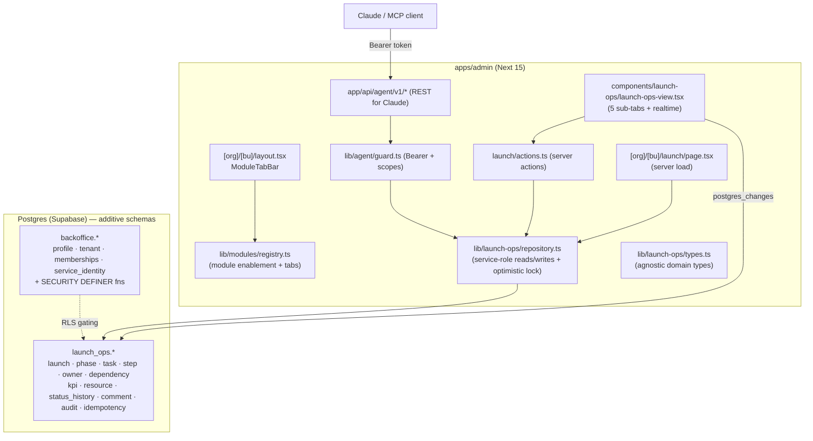

# 01 · Architecture

## Principles

- **Self-contained in `apps/admin`.** No code paths in `apps/web` / `apps/api`
  are added or modified. The tracker talks to Postgres directly through the
  admin's existing Supabase clients.
- **Modular back office.** Each BU enables a set of modules (Campaigns,
  Responses, Launch Ops). A registry drives the tab bar; enabling a module is
  data, not code.
- **Agnostic core.** The domain layer (types + repository) is decoupled from
  the physical row shape and from any specific launch. DI21-C2 is just seed data;
  another creator/launch slots in with zero code change.
- **Two trust planes.** Humans use the session (RLS-aware). The agent uses a
  scoped Bearer token, never `service_role`.

## High-level diagram



## Request flows

### Human (UI)
1. Middleware enforces a Supabase session for all non-public paths.
2. `[org]/[bu]/layout.tsx` renders the `ModuleTabBar` (only if >1 module enabled).
3. `launch/page.tsx` (Server Component, `force-dynamic`) resolves the launch by
   `(organizer, bu)` and loads the overview via the repository (`service_role`).
4. `LaunchOpsView` (client) renders 5 sub-tabs and subscribes to
   `launch_ops.task` via Realtime.
5. Mutations call **server actions** (`updateTaskStatusAction`, etc.) which run
   server-side, derive the actor from the session, and apply optimistic locking.
6. On success the client calls `router.refresh()`; Realtime also nudges other
   open clients.

### Agent (API)
1. `POST/GET /api/agent/v1/*` bypasses the session middleware (in `PUBLIC_PATHS`)
   and authenticates with its **own** Bearer token.
2. `guard.ts` resolves the identity (env token or hashed `service_identity`)
   and its scopes.
3. Each route enforces the required scope, validates input, applies
   `Idempotency-Key` + `If-Match`, mutates through the same repository, and
   writes an `audit_log` row.

## Why server-role for human reads (for now)

The whole admin already reads with `service_role` (`supabaseAdminForSchema`).
Launch Ops follows that convention so it ships consistently. RLS is still defined
from migration 1 so that:
- the **agent** and any future **creator** logins are correctly gated, and
- the v1 hardening (move human reads to a session/RLS client) is a config change,
  not a redesign.

See [`06-rls-security.md`](./06-rls-security.md) for the ordering constraint that
keeps this safe.

## File map

```
packages/db/src/migrations/
  20260608000000_backoffice_identity.sql
  20260608000100_launch_ops_schema.sql
  20260608000200_launch_ops_seed_di21_c2.sql      (generated)

apps/admin/src/
  lib/modules/registry.ts
  lib/launch-ops/{types.ts, repository.ts}
  lib/agent/{guard.ts, runtime.ts}
  lib/supabase/server.ts                            (+ getSupabaseLaunchOps/Backoffice)
  app/[organizer]/[bu]/layout.tsx
  app/[organizer]/[bu]/launch/{page.tsx, actions.ts}
  app/api/agent/v1/{tasks, tasks/[id], tasks/[id]/comments, progress, bulk-status}/route.ts
  components/launch-ops/{launch-ops-view.tsx, module-tab-bar.tsx, realtime.tsx}
  middleware.ts                                     (+ '/api/agent' public)
  scripts/{gen-launch-ops-seed.mjs, validate-launch-ops-seed.mjs, smoke-agent-api.mjs}
```
