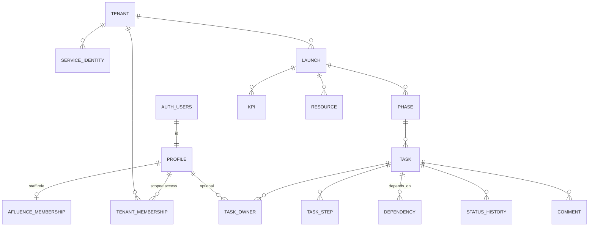

# 02 · Data Model

Two additive schemas. Nothing references `marketing` or `meta_ops` by FK; the
link to those worlds is a loose `(organizer_slug, bu_slug)` on `launch`.

## ERD

## `backoffice` schema

### profile
Identity. `id == auth.users.id` for login users. `user_kind ∈ {afluence, creator, service}`.

### tenant
A client workspace. `slug` unique; `organizer_slug` / `bu_slug` loosely map to
meta_ops/web. One tenant per creator/BU.

### afluence_membership
Presence ⇒ internal staff. `role ∈ {admin, director, member}`. Drives
`is_afluence()` / `is_afluence_admin()`.

### tenant_membership
Scoped access (esp. creators). `role ∈ {owner, editor, viewer}`; `modules` is a
jsonb array (`["launch","responses"]` or `["*"]`). Unique `(tenant_id, user_id)`.

### service_identity
Non-human actors. `slug` (e.g. `claude:launch-ops-agent`), `token_hash`
(sha256, never raw), `scopes text[]`, optional `tenant_id`, `active`.

### Helper functions (SECURITY DEFINER, pinned `search_path`)
`current_user_id()`, `is_afluence()`, `is_afluence_admin()`,
`can_read_tenant(tenant_id)`, `can_write_module(tenant_id, module)`.

## `launch_ops` schema

### launch
| col | notes |
|-----|-------|
| `code` | unique, e.g. `DI21-C2` |
| `tenant_id` | nullable FK → backoffice.tenant |
| `organizer_slug` / `bu_slug` | loose link for routing from `/[org]/[bu]/launch` |
| `status` | `planning · active · closed · archived` |
| `config` | jsonb: dates, price ladder, thesis target, avg price, HT price |

### phase
`code` (`F0`..`F5`), `name`, `position`. Unique `(launch_id, code)`.

### task — the core
| col | notes |
|-----|-------|
| `source_index` | stable 1-based index from the source doc (dependency refs) |
| `title`, `objective`, `definition_of_done` | from `t / obj / crit` |
| `channel` | IG, Email, Meta Ads, Whop, ... (display/filter) |
| `workstream` | `organico · inorganico · infra` |
| `due_label` / `due_start` / `due_end` | raw label + best-effort parsed dates |
| `status` | `todo · doing · blocked · done` |
| `progress_pct` | 0–100 |
| `version` | **optimistic lock**; bumped by trigger on every update |
| `updated_by` | actor string; `claude:*` ⇒ recorded as agent |

Indexes: `(launch_id)`, `(phase_id)`, `(launch_id,status)`, unique `(launch_id,source_index)`.

### task_step
Ordered checklist steps (`position`, `body`, `done`).

### task_owner
M:N via `owner_key` text (agnostic: `nico/mau/german/tomas/elba`) + optional
`profile_id` once identities exist. PK `(task_id, owner_key)`.

### dependency
`depends_on_task_id` (structured) **or** `note` (free text like
"Tras: grabación", "Rescatado del playbook"). The seed resolves `#n` refs to the
right task via `source_index`.

### kpi
Launch scorecard: `key, label, target_label, value, unit, is_computed, formula`.
`revenue` is computed in the UI (`buyers×avg + buyers×%ht×ht`).

### resource
Centralized links: `category (landings/comms/tracking/assets/docs)`, `key`,
`label`, `owner_key`, `url`, `status (pending/ready)`.

### status_history (append-only)
Written by trigger on status change: `from_status, to_status, actor, actor_type`.

### comment
Notes (`body, kind, actor, actor_type`). Agent notes recorded as `agent`.

### audit_log + idempotency_key
Agent-facing. `audit_log` is append-only (`actor, action, entity, entity_id,
idempotency_key, request`). `idempotency_key` stores prior responses for safe retries.

## Triggers
- `touch_updated_at` on launch/kpi/resource.
- `task_before_update`: sets `updated_at`, bumps `version` (unless caller set it).
- `task_after_status_change`: appends `status_history`, infers `actor_type` from
  the `updated_by` prefix (`claude:` / `:agent` ⇒ agent).

## Seed mapping (source → tables)

| Source doc (`DI21-C2-Centro-Operaciones.html`) | Table |
|---|---|
| `PH[]` | `phase` |
| `T[].t / obj / crit` | `task.title / objective / definition_of_done` |
| `T[].steps[]` | `task_step` |
| `T[].o[]` | `task_owner` |
| `T[].dep` (`#n` + free text) | `dependency` |
| `T[].d` | `task.due_label / due_start / due_end` |
| `M[i]` (`[channel, tipo]`) | `task.channel / workstream` |
| KPI scorecard | `kpi` |
| Enlaces tables | `resource` |
